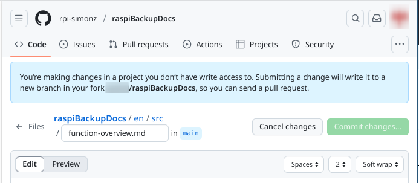
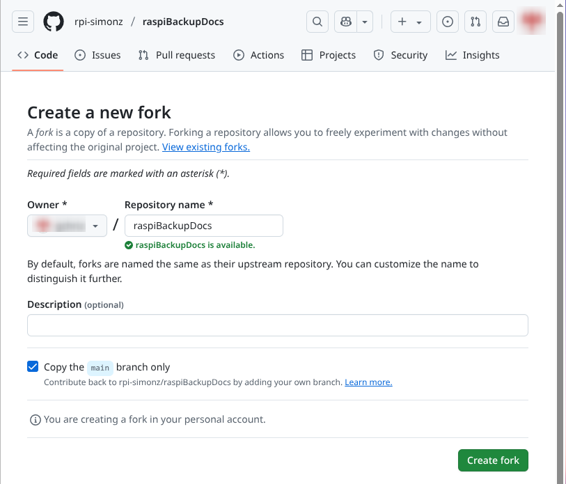
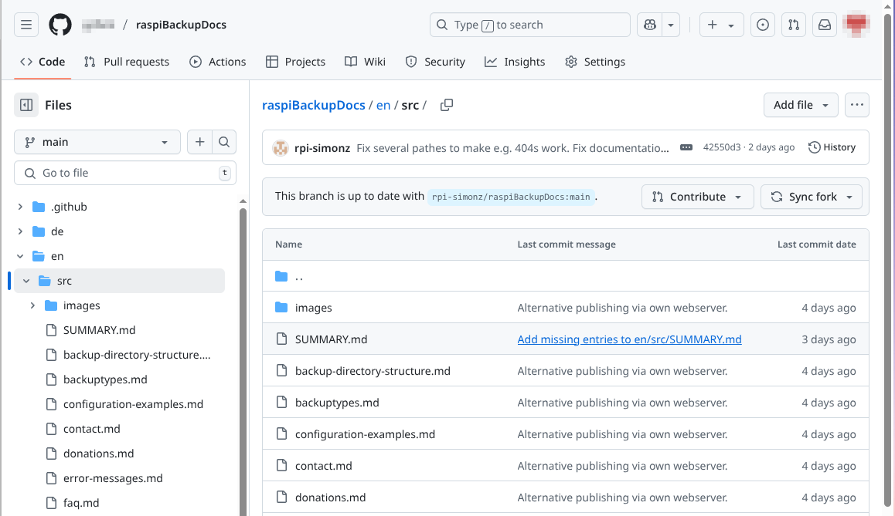
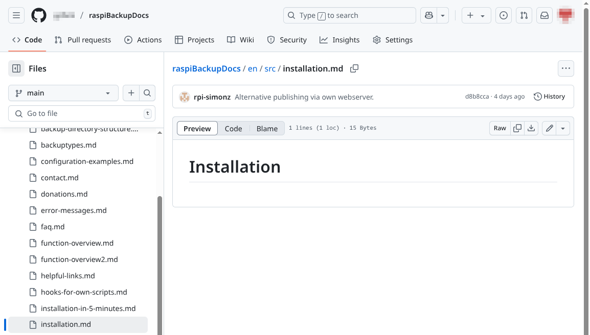
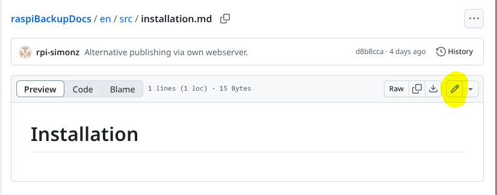
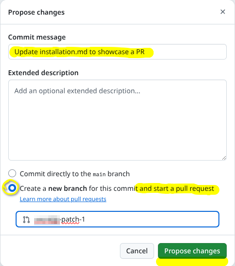

# Mitwirken an der Dokumentation

Leser/Nutzer, die etwas zur Dokumentation beitragen möchten,
können dies folgendermaßen tun:

## Vorschläge machen, Probleme melden usw.

Bitte einen "Issue" bei *GitHub* anlegen: <https://github.com/raspibackupdev/raspiBackupDoc/issues>


## Sich über die Doku mit anderen Nutzern austauschen

Im *Raspberry Pi Forum*, Unterforum "raspiBackup": <https://forum-raspberrypi.de/forum/board/164-raspibackup/>


## Selber Inhalte ändern, ergänzen oder neu erstellen

**Hinweis**: Da das Repository mit der Dokumentation auf *GitHub* gehosted wird,
ist ein (kostenloser) GitHub-Account erforderlich.

Es gibt (mindestens) drei Wege:

  - Am einfachsten: [Über das "Editieren"-Icon auf jeder Seite der Dokumentation](#edit_icon)
  - [Manuell über GitHub](#github_manual)
  - [Manuell lokal](#local_manual)

Zum Aufbau der Markdown-Dateien siehe [EDIT.md](EDIT.md)

<br/>
<br/>
<br/>

--------------------

<a name="edit_icon"></a>
### Über das "Editieren"-Icon auf jeder Seite der Dokumentation

Dies ist der einfachste Weg!

1. Das "Editieren"-Icon auf der zu ändernden Seite der Doku anklicken

   

1. Hinweis zum Forken bestätigen (das kommt nur beim ersten Mal)

   

1. Den Inhalt der Datei editieren, die Änderungen bestätigen ("commit changes")
   und dann den weiteren Schritten zum neuen Branch und Senden des Pull-Request folgen.

   

  1. warten, bis der Repo-Owner den PR annimmt  ;-)


<br/>
<br/>
<br/>

--------------------

--------------------

**Die folgenden Wege sind eher für technisch Interessierte und Entwickler von Bedeutung:**

--------------------

--------------------

<a name="github_manual"></a>
### Manuell über GitHub

  1. Das Repository kopieren: "Fork"
  1. Editieren von Markdown-Datei(en) in Verzeichnis `<sprache>/src/`
  1. Eine neue Version erstellen: "Commit"
  1. Pull-Request (PR) erstellen: "Create pull request"
  1. warten, bis der Repo-Owner den PR annimmt  ;-)

#### Ausführlicher beschrieben

1. Erzeugen eines Forks des Original-Repository

   
   

1. Im neu erzeugten Fork im eigenen Repository zu einer zu editierenden Datei navigieren

   
   
   

   Diese editieren, dann committen

   
   

1. und in einem neuen Branch speichern

   

1. Dann daraus den *Pull Request* erstellen

   
   

--------------------

<a name="local_manual"></a>
### Manuell lokal

  1. Das Repository kopieren/clonen

     ```
     git clone https://github.com/raspibackupdev/raspiBackupDoc.git
     ```

  1. Editieren von Markdown-Datei(en) in Verzeichnis `<sprache>/src/`

  1. Eine neue Version erstellen und hochladen

     ```
     git commit ...
     git push ...
     ```

  1. Pull-Request (PR) erstellen, online bei GitHub

     "Create pull request"

  1. warten, bis der Repo-Owner den PR annimmt  ;-)

