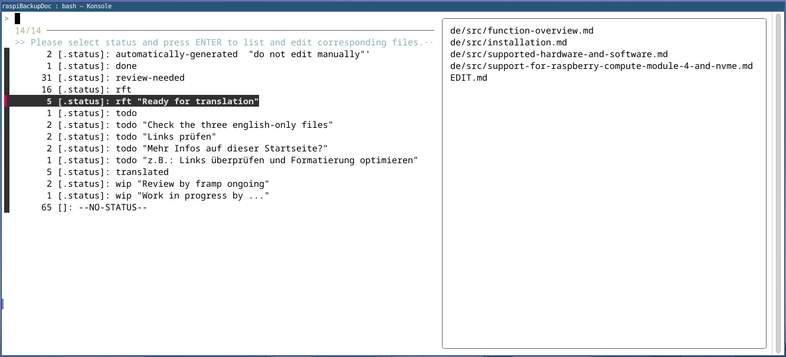
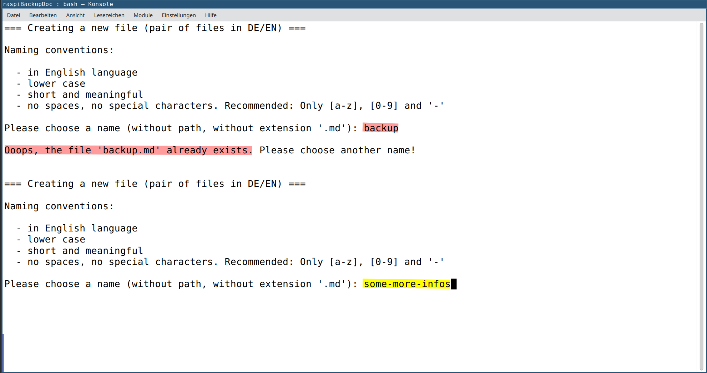
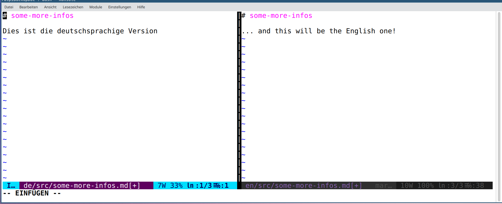
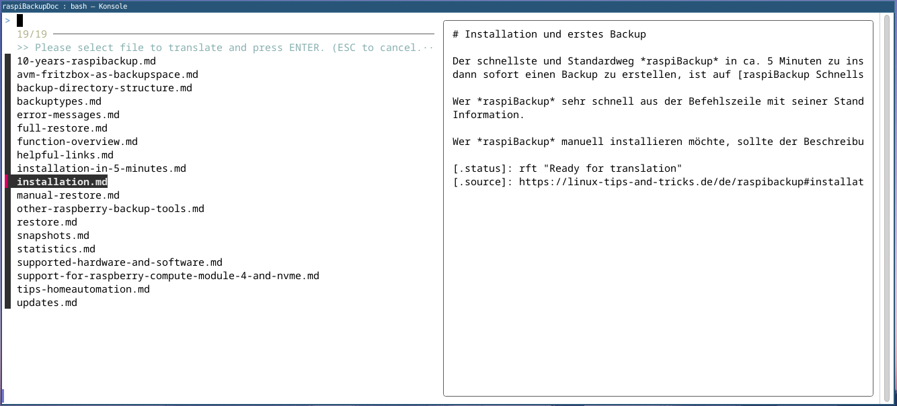
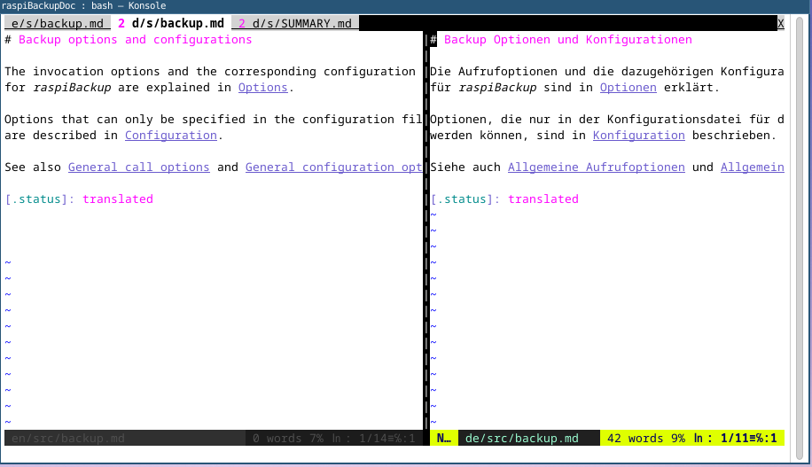
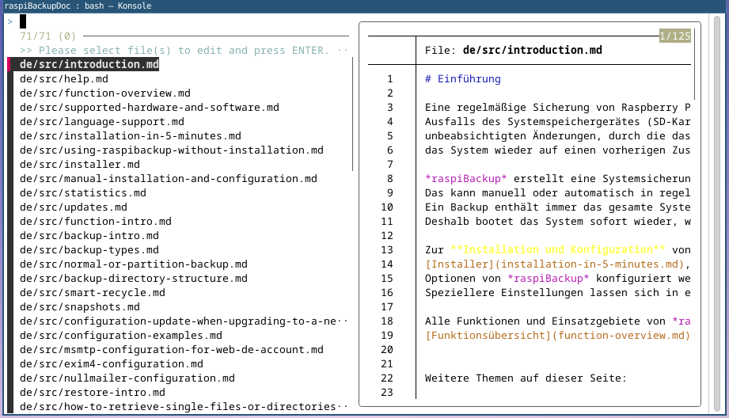
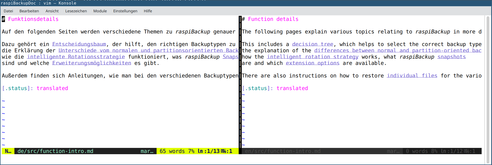
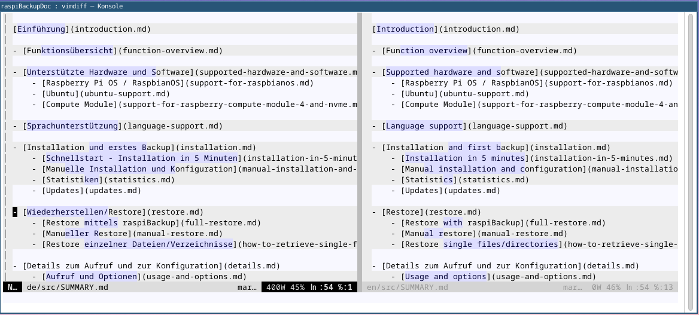
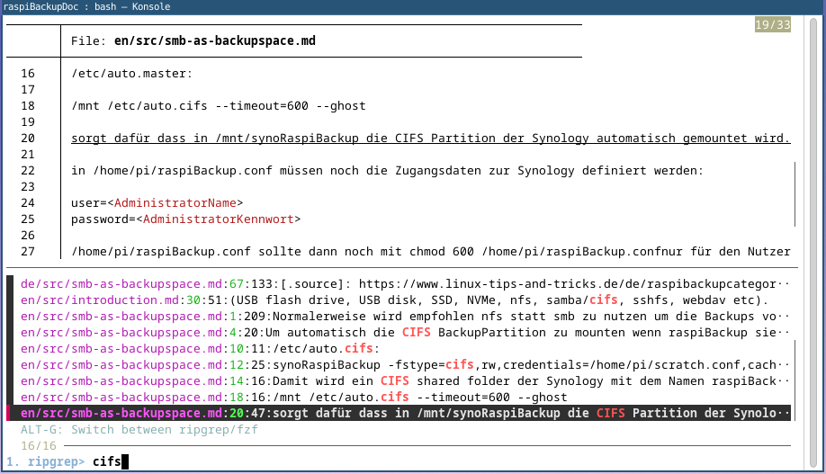
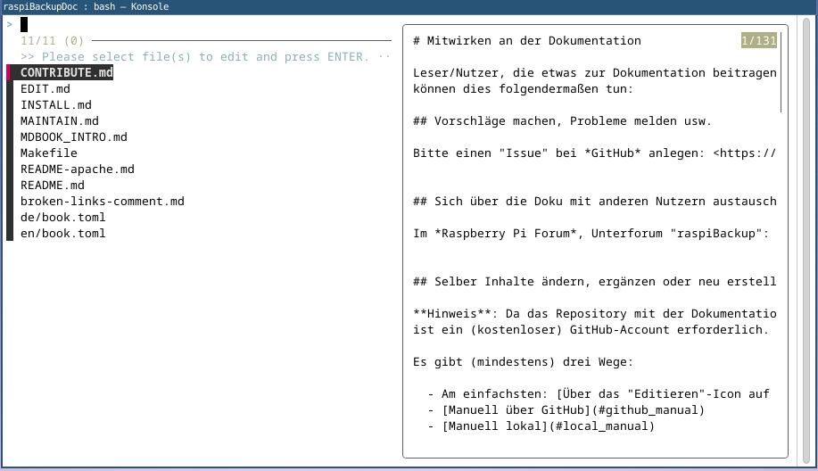

# Arbeiten an/in/mit den Inhalten der Dokumentation

Bei dem für die Dokumentation verwendeten Generieungstool *mdbook* befinden sich
normalerweise alle Inhalte in einem direkten Unterverzeichnis `src/`.

Da die Dokumentation von *raspiBackup* aber mehrsprachig aufgebaut ist,
befinden sich die Inhalte hier im Projekt sprachabhängig in den Unterverzeichnissen

    de/src/
    en/src/

In den (jeweiligen!) Verzeichnissen `src/` können bei Bedarf auch Bilder, Icons
etc. untergebracht werden, sinnvollerweise in passend benannten Unterverzeichnissen.
Das heisst: Für jede Sprache extra.
Diese eventuelle mehrfache Speicherung von gleichen Dateien beruht auf der
zugrunde liegenden Technik und lässt sich zur Zeit nicht vermeiden.

Beispiel:

    ├── de
    │   ├── book.toml
    │   ├── src
    │   │   ├── 10-years-raspibackup.md
    │   │   ├── images
    │   │   │   ├── CM4.jpg
    │   │   │   ├── icons
    │   │   │   │   └── ...
    │   │   │   └── ...
    │   │   ├── installation.md
    │   │   ├── SUMMARY.md
    │   │   └── ...

Die eigentlichen Inhalte sind Textdateien (im *Markdown*-Format),
die sich mit jedem Texteditor bearbeiten lassen.

Hilfreich ist ein Editor, der "Syntax Highlighting" für *Markdown* unterstützt.

Eine kurze Einführung zum verwendeten Generierungstool *mdbook* gibt es [hier](MDBOOK_INTRO.md).

**Tipp**: Siehe auch Originalbeschreibung von *mdbook* <https://rust-lang.github.io/mdBook/guide/creating.html>


## SUMMARY.md - Das Inhaltsverzeichnis / Die Struktur der Dokumentation

Dies ist der wichtigste Teil der Dokumentation.

In der Datei `SUMMARY.md` wird die Struktur des zu erzeugenden Buches erfasst.
Und zwar durch einen "Baum" von (Markdown-)Links mit Kapitelnamen und den
dazugehörigen Dateien im Filesystem (`*.md`).

Das bildet das Inhaltsverzeichnis!

Beispiel:

    # raspiBackup

    [Einführung](introduction.md)

    - [Installation]()
        - [Installation in 5 Minuten](installation-in-5-minutes.md)
        - [Updates]()
    - [Backup](backup.md)
    - [Restore]()

Wenn die Links dort schon Dateinamen enthalten, werden diese Dateien
automatisch angelegt und sie sind im Inhaltsverzeichnis anklickbar.

Bei leeren Links (wie oben z.B. bei `[Updates]()`) wird zunächst nur ein nicht
anklickbarer Eintrag erzeugt.

Die Struktur wird also in beiden Fällen im Dokument schon gut sichtbar.

Die `SUMMARY.md` wird insbesondere auch zum Synchronisieren der verschiedenen
Sprachversionen genutzt. Deshalb sind die Dateinamen in englischer Sprache
und bei beiden Sprachversionen identisch!


## Die einzelnen Dateien/Kapitel

Die **Dateinamen** der Kapiteldateien bitte immer

  - englisch-sprachig
  - kurz und prägnant
  - ohne Leerzeichen, ohne Sonderzeichen
  - kleingeschrieben
  - mit der Endung `.md`

ausführen bzw. schon vorhandene Dateinamen nutzen.
Dann ist beim späteren Lesen der fertigen Dokumentation das Umschalten zwischen den Sprachen möglich.

Der **Inhalt** der Dateien ist mit der Auszeichnungssprache *Markdown* formatiert.

**Hinweis**: *mdbook* verwendet den Markdown-"Dialekt"
*Erweitertes CommonMark* (<https://rust-lang.github.io/mdBook/format/markdown.html>).

Wie der Name "Erweitertes Commonmark" ahnen lässt, bietet es zusätzliche Features.

Ein relativ spezielles Feature sind [Link-Referenzen](https://spec.commonmark.org/0.31.2/#link-reference-definitions).

Dieses Feature wird hier explizit erwähnt, weil es im Projekt für weiterreichende
Aufgaben eingesetzt wird, wie es im nächsten Kapitel beschrieben wird.

Link-Referenzen werden zur leichteren Verlinkung (z.B. bei Mehrfachnennung) eingesetzt:

```
Siehe in [hier](ein_langer_pfad_und_dateiname_zum_hinweis23.md "Wichtigster Hinweis! Bitte beachten")
Bla, blubb ...
Und nicht vergessen: siehe [hier](ein_langer_pfad_und_dateiname_zum_hinweis23.md "Wichtigster Hinweis! Bitte beachten")
```

kann damit übersichtlicher werden zu (Achtung, geänderte Klammerung beachten!):

```
Siehe in [hier][hinweis23]
Bla, blubb ...
Und nicht vergessen: siehe [hier][hinweis23]


Und irgendwo auf der Seite dann:

[hinweis23]: ein_langer_pfad_und_dateiname_zum_hinweis23.md "Wichtigster Hinweis! Bitte beachten"
[hinweis24]: ein_pfad_und_dateiname.md
```

Die Definitionen bestehen aus `[name]: Linkadresse` bzw.
mit optionalem Link-Titel: `[name]: Linkadresse "Link Title"`.


### Spezielle hier in diesem Projekt genutzte Markdown-Features

Um die Arbeit an den Inhalten der Dateien und auch an den Übersetzungen besser
organisieren zu können, gibt es in diesem Projekt in vielen Markdown-Dateien
ergänzende "Tags", Markierungen, Kommentare.

Da *Markdown* aber nativ keine Kommentare unterstützt, werden oben beschiebene
*Commonmarks Link References* "zweckentfremdet".
Allerdings muss die Syntax auch in diesem Fall eingehalten werden:
`[name]: Linkadresse "Link Title"`.

Um diese Spezial-Nutzung, also die gewünschte Unsichtbarkeit für den normalen Nutzer,
deutlich zu machen, beginnen die Namen hier mit einem Punkt `.`.

Bei einheitlicher Benennung lassen sich damit auch `grep` oder andere Tools
(vimgrep,...) einsetzen, um die Dokumentenmenge im Griff zu haben.

Der optionale Linktitel (in `""`!) lässt sich für etwas längeren Text nutzen.


Hier einige Beispiele für diese Tags/"Kommentare":

#### Angabe von Referenzen auf Übersetzungs- oder Quelldateien

```
[.de]: ../../de/src/10-years-raspibackup.md

[.source]: https://linux-tips-and-tricks.de/de/anwendungstipps
```

#### Angaben zum Status der jeweiligen Datei

```
[.status]: done
[.status]: todo
[.status]: todo "z.B.: Links überprüfen und Formatierung optimieren"
[.status]: wip "Work in progress by ..."

[.status]: review-needed
[.status]: rft "Ready for translation"
[.status]: rft
[.status]: translated
```

#### weitere variable Anwendungsmöglichkeiten

```
[.workaround]: _ "Probleme beim Syntax-Highlighting in vim-markdown bei non-balanced-underlines"
```

## Hilfsmittel zur weiteren Unterstützung der Autoren

Zur Unterstützung bei der Arbeit mit den (eventuell vielen) Dateien
stehen diverse Tools zur Verfügung. Diese Tools sind zur Nutzung im
Terminal/in der Shell eines Linux-Systems ausgelegt (CLI/TUI).

Als Editor wird *vim* ("vi improved") verwendet.

Die meisten Tools sind in der Bash-Script-Datei `.cdprc` implementiert,
die zur Nutzung nur ge-source-d werden muss:

```
source .cdprc`
```

`.cdprc` ist Teil des Tools [cdp - "cd project"](https://github.com/rpi-simonz/cdp) von *rpi-simonz*,
kann aber auch wie hier beschrieben eigenständig verwendet werden.

Die aktuelle Liste der eingebauten Tools wird beim `source .cdprc` angezeigt:

```
*******************************************************************************

This project directory is for maintaining the 'raspiBackup' documentation.

Some new shell commands (aliases) are defined now,
the main one is 'vibs' ("vi by status").

It starts a TUI for selecting Markdown files by their status for editing.

After selecting a status and pressing 'Enter' or 'Cursor right' a list of
corresponding files is shown.
Selecting a file and pressing 'Enter'/'Cursor right' opens that file for editing.
Pressing 'Alt-t' does almost the same, but opens both language versions
of that file in a splitscreen to support translating/proof reading.

Within the main screen of the TUI there are additional hotkeys active:

  * Alt-n for creating a new (pair of) files and open them for edit/translate.

  * Alt-r / Alt-t for more selection screens, meant for supporting translation.
    They list files with status "(r)eady for translation" / "(t)ranslated" and
    open the selected file in both language versions in a split editor window.

  * Alt-b for a selection of all German Markdown files ordered as in the
    corresponding SUMMARY.md file - like the produced (b)ook.
    Alt-Shift-B the same for the English version.
    This one has its own alias 'viab [DE|en]' ("vi as book").

    And additionally Alt-Shift-S or alias 'viabs' for editing both DE/EN files
    in a splitscreen ("vi as book side by side").

  * Alt-s for calling 'vimdiff' with the (S)UMMARY.md files of both languages.

  * Alt-g for calling an interactive (g)rep-Tool using ripgrep, fzf and vim.
    This one has its own alias 'vigf' ("vi grepped files").
    Alt-Shift-G is the same with current status as preselected query.

  * Ctrl-r for reloading/refreshing the list of status entries

The above functions handle Markdown source files for the documentation itself.
Administration files like README, Makefile and book.toml can be selected too:

  * Alt-m for editing the (M)eta files.
    This one has its own alias 'vimf' ("vi meta files").

Complementing all these functions there might be (there are!) tools in the used
editor as well, *vim* in this case.
For example there is a translation helper DE..EN using *DeepL*:
Ctrl-t, Ctrl-e ("translate to english"). Please read EDIT.md for more details.
*******************************************************************************
```


Der zentrale Einstig ist der Alias `vibs` ("vi by status")
zur Auswahl von Datei(en) mit einem gewünschten Status.

Einige der in `vibs` eingebauten Tools haben zusätzlich eigene Aliase:

  - Alt-b/Alt-Shift-B: `viab [de/en]` "vi files as book"
  - Alt-Shift-S: `viabs` "vi as book side by side"
  - Alt-g: `vigf` "vi grepped files"
  - Alt-m: `vimf` "vi meta files"

Hier der Hauptbildschirm von `vibs`:

  

Die Navigation in `vibs` und den integrierten Tools geschieht mit den
Cursor-Tasten, Enter, ESC und TAB.

  - Cursor auf/ab bewegt den Selektionsbalken auf und ab.
  - TAB markiert einen Eintrag zur Mehrfachauswahl (wo vorhanden/erlaubt)
  - Enter bzw. Cursor rechts wählen die selektierte/markierten Datei(en) aus
  - Esc bzw. Cursor links brechen ab/gehen einen Schritt zurück

Die in `vibs` eingebauten Tools können per Tastenkombination aufgerufen werden.

Zusätzlich zu den im Folgenden mit Beispiel-Screenshots aufgeführten Funktionen
gibt es in einfachen Dateiauswahllisten noch die Tastenkombination Alt-t,
mit der die selektierte Datei in geteiltem Bildschirm in DE und EN parallel
zum Editieren geöffnet wird.

**Hinweis**: Der Hauptbildschirm kann mit Ctrl-r ("reload") aufgefrischt werden,
zum Beispiel, falls nicht alle neuen/geänderten Stati angezeigt werden.


### Erzeugen einer neuen Datei bzw. Datei-Paares (DE/EN) [Alt-n]



... und Editieren in geteiltem Bildschirm



### Auswahl noch zu übersetzender/schon übersetzter Dateien [Alt-r/Alt-t]




### Auflistung aller Dateien in Buch-Reihenfolge (DE: [Alt-b], EN: [Alt-Shift-B])

(wie in SUMMARY.md definiert)



### DE/EN Dateien in Buch-Reihenfolge in geteiltem Bildschirm [Alt-Shift-S]



### Abgleich der SUMMARY.md in den beiden Sprachen [Alt-s]



### Interaktives Grep-Tool [Alt-g]



### Auswahl der Meta-Dateien (Doku und Verwaltung) [Alt-m]




## Weitere Tools

Des weiteren befinden sich im `bin/` Verzeichnis

  - `check_files.sh`   # prüft auf Konsistenz zwischen deutschen und englischen Dateien und den SUMMARY.md's.
  - `deepl-usage.sh`   # siehe unten
  - `mdlinkcheck.py`


Obiges `mdlinkcheck.py` ist (auch) als eigenständiges Projekt online [mdlinkcheck.py](https://github.com/rpi-simonz/mdlinkcheck).
Es wird zum Überprüfen der projekt-internen Links in den Markdown-Dateien verwendet.

Und zwar über das `Makefile`, siehe [MAINTAIN.md](MAINTAIN.md).


## Tools zur Übersetzung

Neben den in `vibs` enthaltenen Tools für den Zugriff auf zu übersetzende/schon
übersetzte Dateien (s.o.) ist die Benutzung von [DeepL](https://www.deepl.com) per Plugin für `vim` möglich.

Hier vorab eine kurze Zusammenfassung:

*DeepL* bietet eine [API](https://www.deepl.com/de/pro-api) an, die - mit einer Begrenzung auf 500.00 Zeichen pro Monat -
gratis verwendet werden kann.

Es ist allerdings eine Registrierung, inkl. Name, Adresse und Kreditkartendaten
erforderlich, um Missbrauch zu unterbinden...

Nach Registrierung erhält man einen API-Key, der bei den jeweiligen Aufrufen
angegeben werden muss.

Zum Beispiel lässt sich die API mit `curl` und diversen Programmiersprachen,
z.B. per [Python](https://github.com/DeepLcom/deepl-python) nutzen.

Für die Integration per Plugin in `vim` habe ich [deepl.vim von ryicoh](https://github.com/ryicoh/deepl.vim) gewählt.

Dieses Plugin lässt sich installieren z.B. mittels [junegunn's vim-plug](https://github.com/junegunn/vim-plug)
per Eintrag in die `.vimrc`:

```
Plug 'ryicoh/deepl.vim'
```

Leider hat das Plugin einen Bug, der unter bestimmten Umständen zu
zusätzlichen Leerzeilen führt. Deshalb habe ich es geforked und korrigiert.

Bitte also alternativ in `.vimrc` eintragen:

```
Plug 'rpi-simonz/deepl.vim' , { 'branch': 'improve_linewise' }
```

Mit einem folgendem Neustart von `vim` und einmaligem Aufruf in `vim` : `:PlugInstall`
wird das Plugin dann installiert und aktiviert.

Weiterhin wird in `.vimrc` die passende DeepL-URL, der DeepL-API-Key und die Tastenzuordnung eingetragen:

```
" Configuration for deepl.vim (https://github.com/ryicoh/deepl.vim)
let g:deepl#endpoint = "https://api-free.deepl.com/v2/translate"
"let g:deepl#auth_key = "00000000-0000-0000-0000-000000000000:fx"
" or much better via: readfile(expand('~/.config/deepl.auth_key'))[0]
let g:deepl#auth_key = readfile(expand('~/.config/deepl.auth_key'))[0]
"
" replace a visual selection
vmap <C-t><C-e> <Cmd>call deepl#v("EN")<CR>
```

Der Arbeitsablauf könnte dann folgendermaßen sein:

 1. `vibs`
 2. `Alt-r` - Aufruf der noch zu übersetzenden Dateien
 3. Datei auswählen ==> *vim* mit Split-Window englisch/deutsch
 4. Kopieren des deutschen Textes in die englische Datei unter Berücksichtigung der `[.status]:` etc.
 5. In der englischen (aber gerade noch deutschsprachigen) Datei:
     1. schrittweise (z.B. per Absatz) den Text markieren
     2. die passende PlugIn-Hotkey-Folge zum Übersetzen nach Englisch tippen: ctrl-t, ctrl-e.
        (Hinweis: Das ist leichter schnell hintereinander zu tippen als der Default: t, ctrl-e.)
     3. nacharbeiten
 6. In der deutschen Datei `[.status]: rft` auf "translated" ändern
    Speichern und Schließen mit `:xa`   ;-)
    Weiter bei 3.

Wenn `vim` innerhalb von `vibs` über die oben beschriebenen Übersetzungs-Funktionen
`Alt-r` und `Alt-t` aufgerufen wird, wird aktuell folgendes Layout verwendet:

 1. In Tab 1 ist die zu englische Datei für sich alleine
 2. In Tab 2 links die englisch und rechts zum Vergleich die deutsche Datei
 3. In Tab 3 links die englische SUMMARY.md und rechts die deutsche SUMMARY.md

Das Umschalten zwischen den TABs ist in `vim` ja auf vielfältige Weise möglich.
z.B. gt, gT, ctrl-pgup, ctrl-pgdown, ctrl-tab, ctrl-shift-tab, ...

Natürlich lässt sich das alles in `vim` umgestalten, das ist nur die initiale Voreinstellung.

Da beim *DeepL* Free-Account die Anzahl der monatlichen Zeichen begrenzt ist,
macht es Sinn, ab und zu den Stand zu überprüfen.

Das geht natürlich auf der *DeepL* -Kundenseite im Browser.

Einfacher geht es mittels Nutzung der API.

Das simple Tool `bin/deepl-usage.sh` lädt die Werte herunter und gibt sie aus:
```
{"character_count":75300,"character_limit":500000}
```

Wenn `jq` installiert ist, wird stattdessen ausgegeben:
```
You already consumed 75300 characters from your monthly limit of 500000 characters (15%).
```

[.status]: todo "weiter überarbeiten und mit MAINTAIN.md abgleichen"

