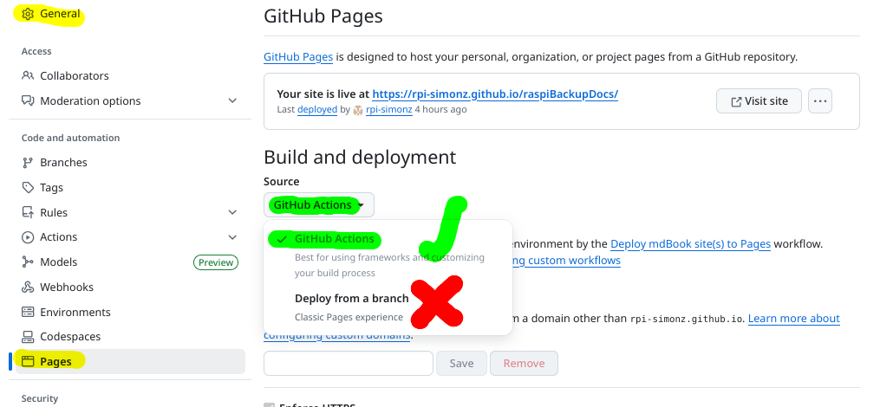

# Maintainer, Repo-Owner, Webserver-Admin

Zum Aufbau der Markdown-Dateien siehe [EDIT.md](EDIT.md)

## Arbeitsablauf bei automatischer Generierung bei z.B. *GitHub Pages*

  1. Editieren von Markdown-Datei(en), lokal oder im Browser
  1. commit + push
  1. ca. 30 Sekunden warten, bis die neue Doku generiert und deployed wurde

Die generierte Dokumentation ist über folgenden Links (GitHub Pages) zu erreichen:

  - https://raspibackupdev.github.io/raspiBackupDoc/
  - https://raspibackupdev.github.io/raspiBackupDoc/de/

Die automatische Generierung wird durch die im Repository enthaltene Datei
`.github/workflows/mdbook.yml` initiiert und gesteuert.

Bei GitHub muss dazu noch in den Einstellungen des Repositories unter
"Build and deployment" ausgewählt werden: "GitHub Actions":

## Ablauf bei Veröffentlichung auf einem (normalen) Webserver

> [!IMPORTANT]
> Voraussetzungen beim lokalen Generieren:
> Die Rust-Umgebung inkl. Compiler `rustc`, `mdbook` und Präprozessoren für `mdbook` müssen installiert sein.
> Siehe [INSTALL.md](INSTALL.md).

  1. lokales Editieren von Markdown-Datei(en)
  1. lokales Generieren der Webseite(n)
     (Zielverzeichnis ist jeweils `book` in den Sprachverzeichnissen.)

     Die Angabe von "en/de" ist erforderlich, weil in diesem Projekt
     die Dokumentation in mehreren Sprachen erzeugt wird,
     deren Quelltexte in eben diesen beiden Unterverzeichnissen liegen.

         mdbook build en     # "en" ist Default und Fallback
         mdbook build de     # "de" ist eine von evtl. mehreren zusätzlichen Übersetzungen

     Testen geht mit einem lokalen Development-Webservice im Browser: http://localhost:3000  
     Da `mdbook serve` bei jeder Änderung der Quelldateien intern ein 'build' aufruft,
     kann **lokal nur jede Sprache einzeln** getestet werden.

         mdbook serve en

     beziehungsweise

         mdbook serve de

  1. Hochladen der Webseite zu einem Webserver

     Hier eine mögliche Variante mit `lftp`:

     **Hinweis**: Beim Upload die Reihenfolge und Zielverzeichnisse der Sprachen beachten, "en" ist Default und damit Erster!

         lftp sftp://${WEBSERVER} -e "cd ${WEBSERVER_ROOTDIR} ; rm -r raspiBackupDocs; mirror -R en/book raspiBackupDocs; cd raspiBackupDocs ; mirror -R de/book de ; put htaccess -o .htaccess ; dir ; quit"

     Details zur Konfiguration des Webservers am Beispiel *Apache* siehe [README-apache.md](README-apache.md)

  1. commit + push

> [!TIP]
> Zur Vereinfachung ist ein einfaches `Makefile` im Repository enthalten.
>
> Es bietet die Kommandos
>
>   - make build
>   - make upload
>   - make all   # (führt beide obigen Kommandos hintereinander aus)

> [!TIP]
> Wenn unbedingt nötig, geht es auch ohne lokales Generieren:  
> Man kann aus dem *GitGub Actions Workflow* die automatisch gebauten Artifacts herunterladen und auspacken.
> Das ist dann die generierte Webseite.
>
> Dann ist allerdings obiger Aufruf von `lftp` noch anzupassen, weil die Webseite schon in finaler Struktur vorliegt.

**TODO**: URL der generierten Dokumentation besprechen und hier nachtragen.

