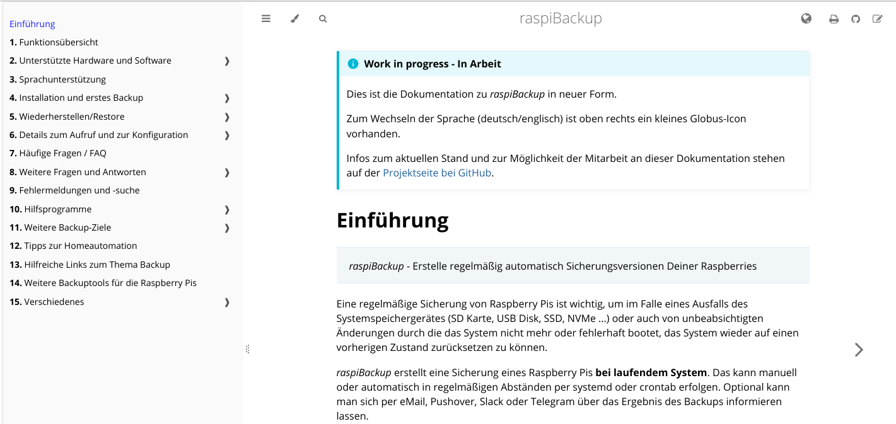

> [!NOTE]
> This repository was initially created by [rpi-simonz](https://github.com/rpi-simonz) with all its logic
> and all German pages were taken from [framp's website](https://www.linux-tips-and-tricks.de/de/raspibackup) to bring the outdated documentation up to date. Ultimately, this repository was transferred from him to framp
> because it logically belongs to raspiBackup and should have the same owner.[rpi-simonz](https://github.com/rpi-simonz) is, of course, a collaborator on this repository 😀
> 
> A big thank you therefore goes to [rpi-simonz](https://github.com/rpi-simonz/), who single-handedly did all the groundwork with great enthusiasm and dedication to bring the raspiBackup
> documentation into a new format and make it clearer. In doing so, he also initiated a revision of the documentation that was long 
> overdue.
> All German pages were translated into English with the help of [DeepL](https://www.deepl.com) to speed up the deployment.
>
> All the documentation about the tool chain created by @rpi-simonz is written in German. If somebody is interested to add new pages or enhance the documentation and is not a German native speaker please create an issue and
> you will get help to complete your task 😉

The documentation is bilingual, with English as the default and German for visitors from German-speaking countries.
To change the language, click on the small globe icon in the top right-hand corner.

<!-- Hinweis:
     Hier in der `README.md` und den anderen GitHub-Dateien wird *GitHub Flavored Markdown* verwendet.
     Siehe z.B. https://docs.github.com/de/get-started/writing-on-github/getting-started-with-writing-and-formatting-on-github/basic-writing-and-formatting-syntax
-->

> [!NOTE]
> Dieses Repository wurde initial von [rpi-simonz](https://github.com/rpi-simonz) erstellt mit all seiner Logik
> sowie allen deutschen Seiten, die von [framps Webseite](https://www.linux-tips-and-tricks.de/de/raspibackup) übernommen wurden um die angestaubte Dokumentation auf Vordermann zu bringen. Letztendlich wurde dieses Repository von ihm an framp
> übertragen, da es logisch zu raspiBackup gehört und denselben Owner haben sollte. [rpi-simonz](https://github.com/rpi-simonz) ist natürlich seitdem Collaborator an diesem Repository 😀
> 
> Ein herzliches Dankeschön geht deshalb an [rpi-simonz](https://github.com/rpi-simonz/), der ganz alleine mit viel Elan und Einsatz die ganze Vorarbeit geleistet hat um die raspiBackup
> Dokumentation in ein neues Format zu bringen und übersichtlicher zu gestalten. Dadurch hat er auch eine Überarbeitung der Dokumentation angestoßen die längst 
> mal fällig war.

Die Dokumentation wird zweisprachig ausgeführt, Englisch als Default und Deutsch für Besucher aus den deutschsprachigen Ländern.
Zum Wechseln der Sprache ist oben rechts ein kleines Globus-Icon vorhanden.

Die generierte Dokumentation ist zu erreichen unter: https://framps.github.io/raspiBackupDoc/

# raspiBackup Dokumentation

Die neue Dokumentation von *raspiBackup* ist nun anders gestaltet als bisher.
Sie ist nicht mehr integraler Bestandteil eines CMS (framps Joomla),
sondern ein eigenständiges "Projekt".

Die Dokumentation - beziehungsweise die Quelltexte davon - befindet sich nun
in einem Repository von Dateien, die in einer einfachen Auszeichnungssprache,
*Markdown*, geschrieben sind.

Dies sind Textdateien, die sich gut bearbeiten und versionieren lassen.
Über das Repository ist eine Teamarbeit an der Dokumentation möglich. ;-)

*Markdown* ist eine von vielen Auszeichnungssprachen,
die sich mit Hilfe von Software gut in andere Formate,
z.B. eben auch in eine Webseite, umwandeln lassen.

Um das Ergebnis in eine ansprechende und gut zu navigierende Form zu bringen,
ist natürlich noch etwas mehr "Drumherum" nötig.

Details dazu finden sich in den Kapiteln

  - [für Mitwirkende am Inhalt](CONTRIBUTE.md)
  - [für Maintainer](MAINTAIN.md)
