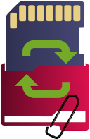

<center>     <!-- The blank line before the image definition is required! -->


</center>


# Backupziele

*raspiBackup* mounted eine Backuppartition, um auf ihr die Backups abzulegen.
Also kann jedes Gerät, von dem eine Partition unter Linux gemountet werden kann,
als Backupziel genutzt werden.

Dazu gehören lokal angeschlossene SD-Karten,
per USB angeschlossene Platten, SSDs,
USB-Sticks und SD-USB-Adapter sowie NVMe-SSDs.
Des weiteren kann [SMB](smb-as-backuptarget.md) und [NFS](nfs-as-backuptarget.md) genutzt werden,
um nicht lokal angeschlossene Backuppartitionen anzubinden.
SSHFS, CurlFtpFS und [WebDAV](webdav-as-backuptarget.md) funktionieren ebenso zur
Ablage der Backups auf entfernten Servern.
Die [*AVM FRITZ!Box*](avm-fritzbox-as-backuptarget.md) unterstützt ebenfalls SMB und kann somit
auch als Backupziel genutzt werden.

```admonish info title="Hinweis"
Die jeweiligen Backupziele müssen eine formatierte Partition haben, in der die Backups abgelegt werden. Siehe [Vor-und Nachteile der jeweiligen
Filesysteme](which-filesystem-can-be-used-on-the-backup-partition.md).
```

Neben den folgenden Kapiteln siehe dazu auch [Wie kann man von der Raspberry Pi auf externe Daten zugreifen](https://linux-tips-and-tricks.de/de/13-raspberry/423-wie-kann-man-von-der-pi-unter-linux-auf-externe-daten-zugreifen).

[.status]: translated
