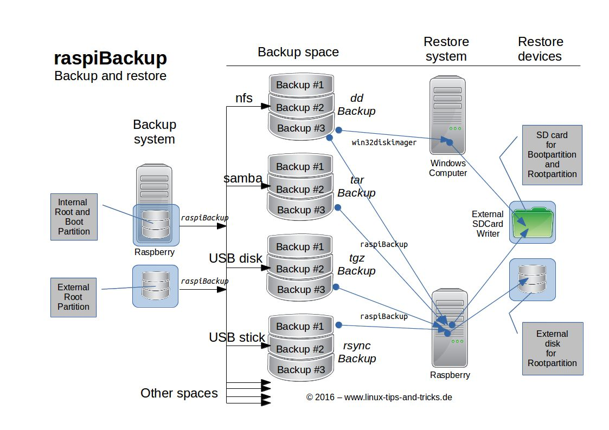

# Funktionsübersicht

**Mit *raspiBackup* erhältst Du schnell und sicher regelmäßig ein vollständiges Systembackup
Deiner Raspberries und eine konfigurierbare Backuphistorie
und kannst somit Deine Raspberry vollständig wiederherstellen,
so dass sie wieder mit einem alten Backupstand bootet**.

  - Automatische regelmäßige Sicherung einer laufenden Raspberry Pi (sie sichert sich selbst)
    Siehe dazu auch [Ist ein Backup eines laufenden Systems zuverlässig? Sollte nicht das gesamte System vor dem Backup gestoppt werden?](faq.md#faq1)

  - Vollständige und inkrementelle Sicherungen

      - Der Backuptyp `rsync` erstellt vollständige und dann inkrementelle Sicherungen
        mittels Nutzung von [Hardlinks](how-do-hardlinks-work-with-rsync.md).
      - Die Backuptypen `dd` und `tar` erstellen immer vollständige Sicherungen (auch gezipped).
        **Hinweis**: Beim `dd` Backup ist per Option einschaltbar, dass nur der von den Partitionen
        belegte Platz und nicht die gesamte SD-Karte gesichert wird.

    Die einzelnen Backuptypen sind im Detail [hier](backup-types.md) beschrieben.
    Dort befindet sich auch ein [Entscheidungsbaum](backup-types.md#decisiontree),
    um schnell den richtigen Backuptyp zu finden.

  - Zwei Sicherungsstrategien

      - Eine definierte Anzahl von Sicherungen wird vorgehalten
      - Sicherungen werden nach der [Großvater-Vater-Sohn Sicherungsstrategie](https://framps.github.io/raspiBackupDoc/smart-recycle.html) (GVS) vorgehalten.

  - Zwei [Backupmodi](normal-or-partition-backup.md):

      - der **normale Backupmodus** sichert nur die Boot- und Rootpartition
      - der **partitionsorientierte Modus** sichert beliebig viele Partitionen

  - Eine beliebige Anzahl von Backups aus der Vergangenheit können vorgehalten werden

    Es wird nicht nur ein einzelnes Backup erstellt, sondern eine Backuphistorie.
    Entweder definiert man eine Anzahl von Backups, die vorgehalten werden sollen,
    oder man nutzt das *GVS*-Prinzip (in *raspiBackup* "Intelligente Rotationsstrategie"
    genannt, siehe [Großvater-Vater-Sohn Generationenprinzip](https://framps.github.io/raspiBackupDoc/smart-recycle.html)

  - Eine intelligente Backupstrategie steht zur Verfügung
    Z. B. können Backups der letzten 7 Tage, der letzten 4 Wochen, der letzten 12 Monate und
    der letzten n Jahre aufgehoben werden.

  - Einfache [Installation](installation-in-5-minutes.md) mit menügeführtem Installer (vergleichbar mit `raspi-config`)

    Die wichtigsten Optionen von *raspiBackup* können in Deutsch, Englisch, Finnisch,
    Chinesisch und Französisch konfiguriert werden,
    so dass die erste [Sicherung in 5 Minuten](installation-in-5-minutes.md) erstellt werden kann.

  - Open source

    *raspiBackup* ist unter der GNU Lizenz als OpenSource und kostenlos verfügbar.
    Ein [Trinkgeld](introduction.md#donation) ist aber trotzdem gern gesehen 😉

  - Alle weiteren z.T. sehr mächtigen Optionen sind [ausführlich dokumentiert](invocation-options.md)
    und können in einer Konfigurationsdatei definiert werden.

  - Beliebige Verzeichnisse und Dateien können aus dem Backup ausgeschlossen werden

  - Verschiedene Backuptypen können pro System gemischt werden (z.B. pro Tag ein `rsync` Backup, jeder Woche ein `dd` Backup)

  - Automatisches Stoppen und Starten von aktiven Services vor und nach dem Backup

  - Sicherung einer beliebigen Anzahl von Raspberries in einem Backupverzeichnis

  - Meldungen werden in Deutsch und Englisch, Französisch oder Finnisch unterstützt.

  - Benachrichtigungen

    Die Sicherungslaufmeldungen können von *raspiBackup* per eMail oder *Telegram*,
    *Slack* oder *PushOver* verschickt werden. Smilies weisen auf Erfolg oder
    Misserfolg des Sicherungslaufes hin. Andere Smilies informieren über andere
    wichtige Ereignisse wie die Verfügbarkeit einer Beta oder eines neuen Releases
    oder die Erinnerung daran, mal wieder einen Restoretest durchzuführen, um die
    Sicherungsintegrität zu testen.

  - Unterstützte eMail-Clients: *mailx*/*mail*, *sendEmail*, *ssmtp* und *msmtp*.
    Nicht unterstützte eMail-Clients können durch ein eMail-Plugin eingebunden werden.

  - Einfaches Update von *raspiBackup* auf die aktuelle Version

  - Einfache Verteilung von neuen Scriptversionen auf eine größere Menge von Hosts

  - Alle Bootmodi werden unterstützt

      1. Boot von einem USB Gerät oder SSD (USB boot Modus): Beide Partitionen
         liegen auf einem USB Gerät. Wird von den neueren Raspberries ab Modell 3B
         unterstützt
      2. Boot von der SD-Karte: Beide Partitionen liegen auf der SD-Karte
         (jedes Modell)
      3. Gemischter Modus: Boot von der SD-Karte und Nutzung der Rootpartition
         von einem USB Gerät. Das ist notwendig bei älteren Raspberries, die
         noch keinen USB Boot unterstützen

  - Beliebige Backupziele sind möglich, z.B.

      - Externer USB Stick
      - Externe USB Platte oder SSD
      - *SMB* Netzwerklaufwerk
      - *NFS* Netzwerklaufwerk
      - *SSHFS* Netzwerklaufwerk
      - *WebDAV* Netzwerklaufwerk
      - *FtpFS* Netzwerklaufwerk
      - Generell jedes Device, welches unter Linux gemounted werden kann

  - Ein externes Rootfilesystem auf einer Platte oder einem USB Stick wird
    automatisch im gemischten Modus beim normalen Backupmodus mitgesichert
    und restored bei `tar` oder `rsync`.

  - Snapshots

    Es können manuell sogenannte *raspiBackup* [Snapshots](snapshots.md) erstellt werden.

    Das sind benannte Backups, die nicht automatisch gelöscht werden.
    Sie dienen zum Beispiel dazu, bei Systemupgrades wichtige Zwischenschritte
    zu sichern, um jederzeit bei Problemen wieder auf vorherige Stände
    zurückgehen zu können.

  - Einfache Wiederherstellung einer Sicherung

    Eine Sicherung des Backuptyps `dd` kann auch auf einem Windows System wiederhergestellt werden.
    *Win32Diskimager* oder ähnliche Tools können genutzt werden.
    `tar` und `rsync` benötigen zur Wiederherstellung ein Linuxsystem.
    Es wird empfohlen, dazu eine vorkonfigurierte SD-Karte mit *Raspberry Pi OS*
    zu nutzen und auf einer Raspberry zu starten.

  - Anpassung von `/etc/fstab` und `/boot/cmdline.txt` an neue UUIDs, PARTUUIDs
    oder LABELs, damit das System sofort wieder startet.

  - Aktive [Social Media Kanäle](introduction.md#contact_options)

  - Benachrichtigungen bei neuen Releases

    Sobald ein Beta oder eine neue Release verfügbar ist, schreibt *raspiBackup* eine
    Meldung, die darauf hinweist. Ein Upgrade ist einfach vorzunehmen. Ebenso ein
    Downgrade zurück auf eine vorhergehende Release.

  - Regressionstestsuite

    Die Basisfunktionalität von *raspiBackup* (Sicherung und Wiederherstellung) wird
    für alle Backuptypen und Modi automatisch getestet, um sicherzustellen, dass das
    neue *raspiBackup* Release genauso zuverlässig funktioniert wie vorher.

  - Dokumentation

    Benutzerhandbuch mit z.B. FAQs, Konfigurationsbeispiele, NFS Konfiguration,
    Liste von Fehlermeldungen und wie man die Fehlermeldungen beseitigen
    kann und vieles mehr ist dokumentiert

  - Hilfs- und Beispielscripts

    Verschiedene [Hilfs- und Beispielscripts](useful-helper-scripts.md) stehen zur Verfügung.

    Sie können die Funktionalität von *raspiBackup* erweitern und entweder unverändert genutzt
    oder an eigene Anforderungen angepasst werden.

    Zum Beispiel, wie *pishrink* genutzt werden kann, um eine `dd` Sicherung noch zu verkleinern
    oder wie parallel ein Clone erstellt werden kann, um ein aktuelles, jederzeit
    einsetzbares Bootmedium zu haben.

    Ein Beispielscript hilft, um vor und nach dem Backup weitere Aktionen vorzunehmen,
    wie z.B. das Mounten und Unmounten des Backupspaces.

    Und vieles, vieles mehr.

  - Erweiterungspunkte

    Für Entwickler bietet *raspiBackup* verschiedene [Erweiterungspunkte](hooks-for-own-scripts.md),
    um Vor- und Nachbereitungen bei der Sicherung wie auch dem Zurücksichern
    durch eigenen Code ausführen zu können.
    U.A. existiert eine Extension, die Dockercontainer vor dem Backup stoppt und anschließend
    wieder startet.

  - Sicherung von *NVMe* Speicher

    Wird für Raspberry 5 und Compute Model 4 (CM4) unterstützt

  - Unterstütze Betriebssysteme

      - RaspbianOS / Raspberry Pi OS
      - Ubuntu

  - Einfacher Systemumzug auf andere Speichermedien

    Jede Sicherung kann auf eine SD-Karte, USB Platte oder SSD sowie NVMe SSD
    zurückgespielt werden. Schon ist das System auf ein anderes Gerät umgezogen.

  - Unterstützung von *Volumio*

  - Unterstützung von *gpt* Partitionen

[.status]: translated
[.source]: https://www.linux-tips-and-tricks.de/de/funktionsuebersicht
[.source]: https://www.linux-tips-and-tricks.de/de/raspibackup
[.source]: https://www.linux-tips-and-tricks.de/en/features
[.source]: https://www.linux-tips-and-tricks.de/en/backup
