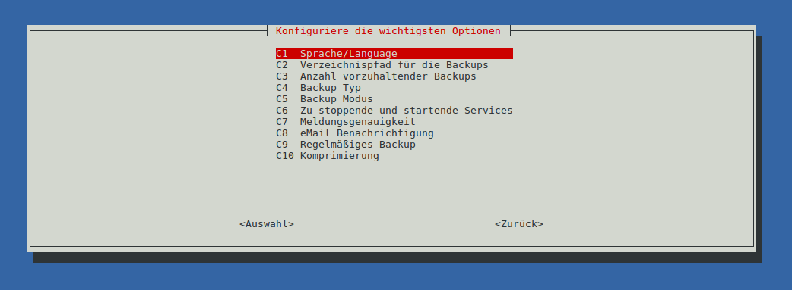

# Schnellstart - Installation in 5 Minuten

Die Dokumentation von *raspiBackup* ist unter anderem durch Erweiterungswünsche von Benutzern
mittlerweile sehr umfangreich geworden.

Um den Einstieg zu erleichtern, wird auf dieser Seite deshalb kurz und
knapp erklärt, wie *raspiBackup* in 5 Minuten installiert und konfiguriert
und dann Backups der Raspberry erstellt werden können.

Auch eine ["adhoc"-Nutzung](#adhoc) von *raspiBackup* ohne Installation ist möglich.

Im Kapitel [Konfigurationsbeispiele](configuration-examples.md) sind einige Inspirationen zum Einsatz von *raspiBackup*
aufgeführt. Diese können zum Kennenlernen der Parameter und damit bei der späteren
Konfiguration während der Installation helfen.

Das Wiederherstellen eines Backups ist detailliert [auf einer eigenen Seite](restore.md) beschrieben.
Dort wird auf die primären Plattformen (Linux, Mac oder Windows) der Benutzer eingegangen.

Vor der Nutzung von *raspiBackup* bitte erst lesen: [Unterstützte Hard- und Software](supported-hardware-and-software.md)

Die Supportkanäle sind [hier beschrieben](introduction.md#kontakt).

**Hinweis:**  "5 Minuten" braucht jemand, der Basiskenntnisse von Linux hat.
Wer diese nicht hat, braucht vermutlich trotz der Hilfe des Installers bei der
Erstellung der Anfangskonfiguration etwas länger. ;-)

**Hinweis:** Von *raspiBackup*-User [Franjo_G](https://forum-raspberrypi.de/user/57610-franjo-g/) gibt es ebenfalls eine [schöne Anleitung im deutschen Raspberryforum](https://forum-raspberrypi.de/article/7-raspibackup-installation-grundeinstellungen-erstes-backup-und-restore/)
zur Installation, Konfiguration und Nutzung von *raspiBackup*.


## *raspiBackup* installieren und automatisch regelmäßig ein Backup erstellen

*raspiBackup* hat einen UI installer, mit dem es sich wie mit `raspi-config`
recht einfach installieren und die primären Optionen konfigurieren lässt.

Alle weiteren Optionen werden in der Konfigurationsdatei
`/usr/local/etc/raspiBackup.conf` mit einem Editor konfiguriert.

Außerdem lassen sich jederzeit die primären Optionen durch erneuten Aufruf
von `raspiBackupInstallUI` nachträglich ändern. Dazu gehört auch eine
Updatefunktion für den Installer und für *raspiBackup*. Die
Installationsführung erfolgt über Menüs sowie über Auswahllisten. Die Menüsprache
kann Deutsch, Englisch, Finnisch, Chinesisch oder Französisch sein.

Wer *raspiBackup* einfach nur mit einer Standardkonfiguration ohne individuelle
Konfiguration installieren möchte, kann das mit den Aufrufoptionen `-i` und
`-e` starten (`-h` für Hilfe benutzen).

Danach kann der Installer zur Anpassung der Basiskonfiguration genutzt werden.

Auf Youtube gibt es ein [Video](https://youtu.be/PuK_FNK674s), auf dem *raspiBackup* vorgestellt
und am Ende eine Demo der Installation gegeben wird.



Zum Download, der Installation und Start des *raspiBackup* Installers bitte
folgendes in der Befehlszeile auf der Raspberry eingeben:

```
cd ~
curl -o install -L https://raspibackup.linux-tips-and-tricks.de/install
sudo bash ./install
```

**Hinweis**: Eine manuelle Installation ohne `sudo` Nutzung ist in einer extra
[Anleitung](manual-installation-and-configuration.md) dokumentiert.

Danach kann man die Installation wählen, bei der eine Standardkonfiguration
benutzt wird. Anschließend ist es möglich, die wesentlichen
Standardkonfigurationsoptionen im Konfigurationsmenü zu ändern. Zum Schluss
kann man die wöchentliche Sicherung mit *raspiBackup* einschalten.

In der Standardkonfiguration geht *raspiBackup* davon aus, dass es einen
Mountpoint `/backup` gibt, unter dem das Backupverzeichnis gemounted ist.
Diesen sollte man mit `sudo mkdir /backup` erstellen und dann dort das externe
Backupverzeichnis mounten.

Der Installer kann jederzeit wieder in der Befehlszeile mit
`sudo raspiBackupInstallUI` aufgerufen werden, um die Konfiguration
zu ändern.

**Hinweis**: Die *raspiBackup* Systemd Konfigurationsdatei ist
`/etc/systemd/system/raspiBackup.timer`. Die Systemdkonfiguration sollte immer
mit dem Installer geändert werden. Manuelle Änderungen in der Datei sollten
"vorsichtig" vorgenommen werden. Sie könnten leicht dazu führen, dass der Installer die
Konfigurationsdatei nicht mehr ändern kann.

Sollte es Probleme geben: Es wird vom Installer immer ein Debuglog in der Datei
`/root/raspiBackupInstallUI.log` angelegt, welches hilft, die Problemursache zu finden.


## Installationsdemo

Das folgende Video zeigt die Installation in Deutsch, da das OS
auf Deutsch konfiguriert war. Ist es auf Finnisch, Französisch, Englisch
oder Chinesisch konfiguriert schreibt der Installer alles in der jeweiligen
Sprache. Die Sprache kann auch im Installer geändert werden.


**Hinweis:**
Benachrichtigungen per eMail benötigen einen korrekt konfigurierten lokalen MTA
wie *Postfix*, *nullmailer*, *msmtp* oder *Exim4*. Wird *Pushover*, *Slack* oder *Telegram*
genutzt, muss die Konfigurationsdatei von *raspiBackup* vorher manuell
entsprechend mit den benötigten Konfigurationsdaten versehen werden.
Siehe Kapitel [Allgemeine Konfiguration](general-config-options.md).
Ein Benachrichtigungstest kann mit der Option `-F` durchgeführt werden.


## Downloadlinks auf *raspiBackup* und den raspiBackupInstaller

Wer sich vor der Installation den Sourcecode von *raspiBackup* und/oder den Installer
*raspiBackupInstallUI* ansehen möchte, kann dies über die folgenden
Downloadlinks tun:

  - [Download *raspiBackup*](https://github.com/framps/raspiBackup/blob/master/raspiBackup.sh)
  - [Download raspiBackupInstallUI](https://github.com/framps/raspiBackup/blob/master/installation/raspiBackupInstallUI.sh)


## Erstellen und Wiederherstellen eines Backups

Nachdem *raspiBackup* installiert wurde, sind folgende Schritte notwendig,
um ein Backup zu erstellen.

Der Mountpunkt zur Ablage der Backups (am Beispiel des Standardmountpunkts),
wird angelegt mit

```
sudo mkdir /backup
```

Anschließend muss ein externes Gerät (USB-Platte, USB-Stick, NFS-Laufwerk, ...)
auf diesen Mountpoint gemounted werden. Im folgenden Beispiel wird eine externe
USB-Platte bzw. ein externer USB-Stick gemountet.

```
sudo mount /dev/sda1 /backup
```

Diese Partition setzt je nach gewünschtem Backuptyp ein gewisses Filesystem voraus,
was in Kapitel "[Welches Dateisystem kann auf der Backuppartition benutzt werden?](which-filesystem-can-be-used-on-the-backup-partition.md)" erklärt wird.
Bitte beachten: [Warum sollte man dd als Backuptyp besser nicht benutzen?](why-shouldn-t-you-use-dd-as-backup-type.md).

**Vor** dem ersten Backup sollte man noch prüfen/sicherstellen, dass wirklich das richtige Backupgerät
bzw. die richtige Backuppartition genutzt wird. Hilfreich sind dabei folgende Befehle:

```
sudo blkid -o list
mount | grep backup
```
oder wenn die Backuppartition lokal angeschlossen wurde und sie ein Label hat

```
sudo blkid -o list | grep <label>
```

Danach ist alles fertig konfiguriert.

Will man das Backup einmal schnell testen, kann es wie folgt erstellt werden.
Das kann je nach Größe der Installation länger dauern.

```
sudo raspiBackup -m detailed
```

**Danach sollte unbedingt ein Restoretest durchgeführt werden** ([Link zur
Restoredokumentation](restore.md)), um zu verifizieren, dass ein konsistentes
Backup erstellt wird, und um sich mit der Restoreprozedur vertraut zu machen.

**Denn:**
Ein Backup nützt nichts, wenn man in dem Moment, wo man es einspielen möchte,
feststellt, dass es nicht zu gebrauchen ist.

Der ganze Restoreprozess sollte von Zeit zu Zeit durchexerziert und damit getestet werden,
ob die erstellten Backups in Ordnung sind und sich damit ein System funktionsfähig
restaurieren lässt. *raspiBackup* erinnert in regelmäßigen Abständen daran,
einen Restoretest vorzunehmen. Das Erinnerungsintervall ist konfigurierbar.
Der Standardwert ist 6 Monate.

Besonders wichtig ist das Testen auch, wenn ein neues System mit einem neuen
Betriebssystem wieder mit *raspiBackup* gesichert wird. Es gibt immer wieder
Änderungen bei neuen Betriebssystemversionen, die dazu führen können, dass der
Restore nicht mehr funktioniert.

Nachdem sowohl Backup als auch Restore erfolgreich getestet und die vor dem Backup
zu stoppenden Services konfiguriert wurden, kann *raspiBackup* per *systemd timer*
für eine automatische Ausführung im gewünschten Intervall eingeplant werden.


## Standardkonfiguration und Ort der Konfigurationsdatei

Der Installer erstellt folgende Dateien:

  - Konfigurationsdatei `/usr/local/etc/raspiBackup.conf`

    In dieser werden folgende Standardwerte eingestellt und können mit dem
    Installer geändert werden. Alle anderen Optionen müssen mit einem Editor
    geändert werden oder mit einer Aufrufoption überschrieben werden.

    | Option               | Einstellung          |
    |----------------------|----------------------|
    | Backuppfad           | /backup              |
    | Backupmode           | normal               |
    | Backuptyp            | rsync                |
    | Sprache              | Sprache des Systems  |
    | Zip                  | nein                 |
    | Meldungsdetail       | normal               |
    | Backupanzahl         | 3                    |
    | Services start       | keine                |
    | Services stop        | keine                |
    | Wöchentlicher Backup | nein                 |
    | Backuptag            | Sonntag              |
    | Backupzeit           | 05:00 Uhr            |

    [Aufruf und Optionen](backup-options.md) sind ausführlich beschrieben.

  - *Systemd timer* Konfiguration `/etc/systemd/system/raspiBackup.timer`

    Diese Datei steuert den Aufruf von *raspiBackup* und im Standardfall ist der
    wöchentliche Backup ausgeschaltet. Er kann aber mit dem Installer eingeschaltet
    werden.

  - *raspiBackup*.sh `/usr/local/bin`

  - *raspiBackupInstallUI.sh* `/usr/local/bin`

## Deinstallation

Sollte sich tatsächlich herausstellen, dass *raspiBackup* nicht den Anforderungen genügt,
steht eine [Deinstallation](installer.md#deinstallation) per *raspiBackup* Installer zur Verfügung.


<a name="next-steps"></a>
## Weitere Schritte

Nachdem das erste Backup erfolgreich erstellt und wiederhergestellt wurde,
sollte man sich in einer ruhigen Stunde über alle weiteren Optionen von
*raspiBackup* informieren und je nach Bedarf einsetzen.

In jedem Falle ist es sinnvoll, sich die [FAQs](faq.md) durchzulesen.

Jede Option kann in der Konfigurationsdatei `/usr/local/etc/raspiBackup.conf` definiert werden,
so dass beim Aufruf keine weitere Optionen angegeben werden müssen.

Details dazu finden sich im Kapitel [Aufruf und Optionen - Backup - Optionen](backup-options.md)
und zu den Optionen, die sich **nur** über die Konfigurationsdatei einstellen lassen
im Kapitel [Aufruf und Optionen - Backup - Konfiguration](backup-config-options.md).

Ebenfalls nützlich: [raspiBackupDialog - ein komfortables Hilfsscript für raspiBackup](raspibackupdialog-a-convenient-helper-script-for-raspibackup.md),
welches die Nutzung und den Aufruf von *raspiBackup* vereinfacht.


<a name="adhoc"></a>
## *raspiBackup* ohne Installation nutzen

1. Download von *raspiBackup*: `curl -sSLO  https://www.linux-tips-and-tricks.de/raspiBackup.sh`

2. Mount der Backuppartition unter `/backup` oder Angabe der Backuppartition als letzten
   Parameter im Aufruf, also z.B. `sudo bash ./raspiBackup.sh /media/pi`

3. Start des Backups:  `sudo bash ./raspiBackup.sh`

Falls kein `rsync` Backup gewünscht wird, muss der Backuptyp `tar` oder `dd` mit Option `-t`
 mitgegeben werden, also `sudo bash ./raspiBackup.sh -t tar` oder `sudo bash ./raspiBackup.sh -t dd`

Kurzinfos zu allen Aufrufoptionen von *raspiBackup* erhält man mit `bash ./raspiBackup.sh -`


[.status]: rst
[.source]: https://linux-tips-and-tricks.de/de/installation
