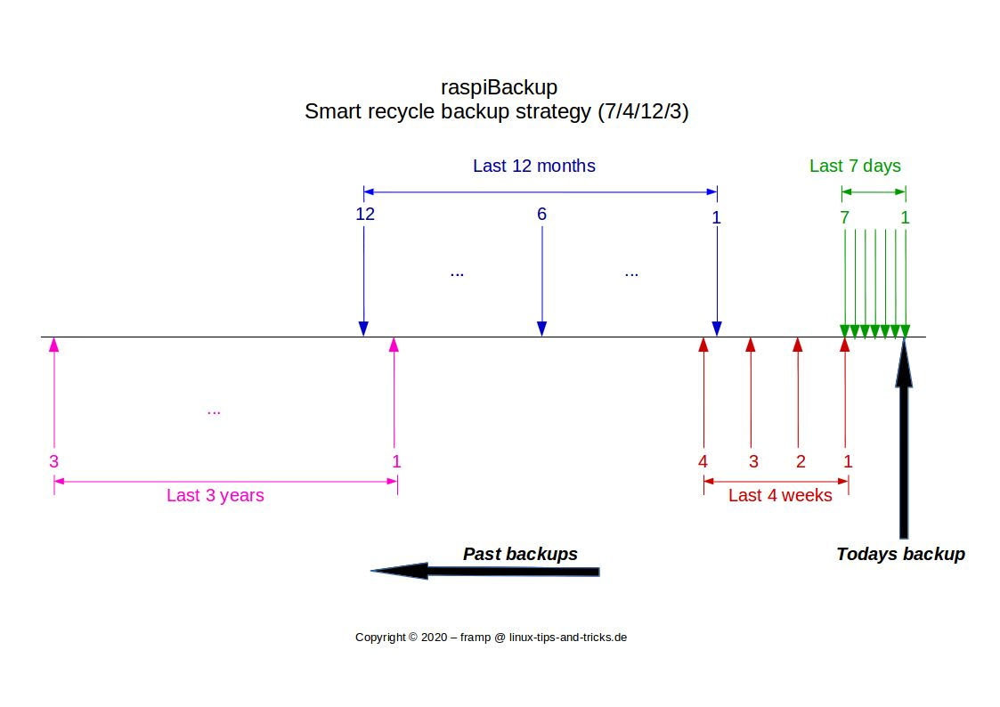

# Intelligente Rotationsstrategie - Smart Recycle

*raspiBackup* kann entweder eine konfigurierbare Anzahl von Backups vorhalten oder eine intelligente
Rotationsstrategie des Backups nutzen. Es wird auch ["Generationenprinzip in
der Datensicherung"](https://de.wikipedia.org/wiki/Generationenprinzip) genannt. Die Implementierung wurde von Manuel Dewalds
Artikel ["Automating backups on a Raspberry Pi NAS"](https://opensource.com/article/18/8/automate-backups-raspberry-pi) inspiriert.
Standardmäßig werden dann folgende Backups vorgehalten,
wenn täglich Backups erstellt werden:

  1. Backups des aktuellen Tages und der letzten 6 Tage
  2. Backups der aktuellen Woche sowie der letzten 3 Wochen
  3. Backups des aktuellen Monats sowie der letzten 11 Monate
  4. Backup des aktuellen Jahres sowie der letzten 2 Jahre

Dieses lässt sich mit dem Installer den jeweiligen Bedürfnissen anpassen.

Werden wöchentliche Backups erstellt, entfallen natürlich die täglichen Backups.
Die jeweilige Aufbewahrungsdauer für täglich, wöchentlich, monatlich und
jährlich lassen sich mit Optionen konfigurieren.

Möchte man also nur wöchentliche, monatliche und jährliche Backups haben, kann
das konfiguriert werden. Dabei ist zu beachten, dass dann der wöchentliche
Backuptag den Backuptag des Monats definiert: Wird z.B. Montag als
wöchentlicher Backuptag konfiguriert, ist das monatliche Backup immer am ersten
Montag im Monat und das jährliche Backup am ersten Montag im Jahr.

``` admonish info title="Hinweis"
Bei mehreren möglichen täglichen Backups wird immer das **neueste** tägliche
Backup aufbewahrt. Bei den wöchentlichen, monatlichen und jährlichen Backups
sind es dagegen die jeweils **ältesten** Backups.

Zum Beispiel wird bei zwei existierenden täglichen Backups von 10:00 und
13:00 Uhr der um 13:00 Uhr erstellte Backup gewählt.

Gibt es in der Woche Montag und Freitag Backups, wird der wöchentliche Backup
von Montag gewählt.

Gibt es einen Backup am 1., 10. und 20. eines Monats, wird das Backup vom
1. für den monatlichen Backup gewählt.

Bei täglichen Backups sind somit wöchentliche Backups immer vom Montag,
monatliche Backups immer vom Ersten des Monats und
jährliche Backups immer vom 1.1. des Jahres.
```

## Grafische Darstellung




## Beispiel - Backupverzeichnis (täglicher Backuplauf, Standardoptionen: 7/4/12/3)

```
    (Backuplauf am 17.11.2019)

    20191117 1. tägliches Backup
    20191116 2. tägliches Backup
    20191115 3. tägliches Backup
    20191114 4. tägliches Backup
    20191113 5. tägliches Backup
    20191112 6. tägliches Backup
    20191111 7. tägliches und 1. wöchentliches Backup

    20191101 1. monatliches Backup
    20191104 2. wöchentliches Backup
    20191001 2. monatliches Backup
    20191028 3. wöchentliches Backup
    20191021 4. wöchentliches Backup
    20190901 3. monatliches Backup
    20190801 4. monatliches Backup
    20190701 5. monatliches Backup
    20190601 6. monatliches Backup
    20190501 7. monatliches Backup
    20190401 8. monatliches Backup
    20190301 9. monatliches Backup
    20190201 10.monatliches Backup

    20190101 11. monatliches Backup und 1. jährliches Backup
    20181201 12. monatliches Backup
    20180101 2. jährliches Backup
    20170101 3. jährliches Backup
```

## Optionen

Die intelligente Rotationsstrategie schaltet man mit der Option `--smartRecycle` ein.
Mit der Option `--smartRecycleOptions` kann man die Aufbewahrungsmengen umdefinieren.
Standardmäßig ist die Option `--smartRecycleOptions "7 4 12 3"` aktiv.
Mit `--smartRecycleOptions "0 4 12 0"` werden z.B. die letzten 4
wöchentlichen und die letzten 12 monatlichen Backups vorgehalten.

``` admonish caution title="Wichtiger Hinweis"
Solange man nicht die Option `--smarteRecycleDryrun` ausgeschaltet hat, schreibt
*raspiBackup* nur Meldungen, welche Backups gelöscht und welche aufgehoben **würden**.

Man kann somit erst einmal kontrollieren, ob das Ergebnis dem Gewünschten entspricht.
Dadurch lässt sich verhindern, dass unbeabsichtigt existierende Backups gelöscht werden.

Das ist besonders wichtig, wenn man nach Umstellung auf die intelligente Rotationsstrategie
das bisherige Backupverzeichnis weiterhin benutzen möchte und kein neues Verzeichnis benutzt.

Wurde sorgfältig geprüft, dass die intelligente Rotationstrategie die
richtigen Backups löscht und die gewünschten Backups aufhebt, wird mit der
Option `--smartRecycleDryrun-` (das `-` am Ende beachten!) in jedem Backuplauf
die intelligente Rotationstrategie angewendet und
**nicht mehr benötigte Backups werden unwideruflich gelöscht**.

Alternativ bewirkt die Konfigurationsoption

`DEFAULT_SMART_RECYCLE_DRYRUN=0`

dasselbe Ergebnis.
```

Auf Wikipedia - im Artikel [Generationenprinzip](https://de.wikipedia.org/wiki/Generationenprinzip) - wird schön erklärt,
wie das Rotationsprinzip funktioniert.
Speziell die Grafik ist eine andere Möglichkeit, das Prinzip zu erklären.


[.status]: rft
[.source]: https://www.linux-tips-and-tricks.de/de/rotationsstrategie
[.source]: https://www.linux-tips-and-tricks.de/en/smart-recycle

