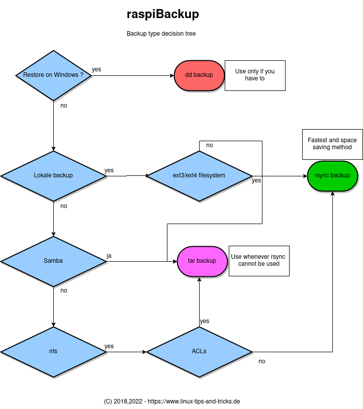

# Decision tree for backup types

There are different backup types and each has its advantages and disadvantages.
Different backup types can be combined. For example, every
months a full backup can be created with `tar` and in between a weekly `rsync` delta backup.
However, this requires manual configuration of *Systemd* timers and requires
good *Systemd* knowledge. The *raspiBackupInstaller* configures only one backup type.

All backup types can be completely restored with *raspiBackup*. A `dd` backup can also be restored wth a Windows system.

A `dd` backup creates a consistent binary image of the system.
The entire device with the system is always read and backed up. This means that
data that has not changed is also backed up. It also means
that the restore device has to be at least as large as the original system for the restore.
No partition is resized. This causes problems especially
with SD cards, as the SD cards - although 32GB in size, for example - always have slight
differences and therefore a restore of a 32GB system to another 32GB SD card
may fail because the SD card is slightly smaller.

But it is **not** recommended to use the backup type `dd`.
Explanations are given in [Why should you not use dd as a backup type?](why-shouldn-t-you-use-dd-as-backup-type.md)
in detail.

A `ddz` backup, like a `dd` backup, backs up the entire system. This method
puts a heavy load on the CPU as the amount of data is reduced. (It is a `dd` backup
with zipping switched on with `-z`). A restore with Windows tools is not possible.

A `tar` backup backs up all the data stored on the system device, although the backup is not
not as large as an `dd` backup, as only the data that actually exists is backed up.
Therefore, a `tar` backup can also be restored on devices
that is smaller than the original device. Of course, only if all
data fits on the new device.

A `tgz` backup backs up the entire system, like a `tar` backup. This method
puts a heavy load on the CPU as the amount of data is reduced. (It is a `tar` backup
with zipping switched on with `-z`)

An `rsync` backup only saves the data that has changed since the last backup, except for the first time.
The hard links of the *ext3*/*ext4* file system
file system ensures that the backup is still consistent.
However, the data is not compressed. However, this in turn has the
advantage that you can easily retrieve individual files from the backup by just copying them.
This method is very fast if an initial
initial backup has already been created.

| Type | Full backup | Backup time | Backup size | Data compression | CPU loaded | Card loaded | Selective restore possible | File system |
|--------|------------|------------|-------------|------------------|--------------|----------------|----------------------------|-------------|
| dd | yes | long | large | no | medium | high | no | all, fat32 only up to 4GB |
| ddz | yes | long | smaller | yes | yes | high | no | all, fat32 only up to 4GB |
| tar | yes | medium | medium | no | medium | yes | all, fat32 only up to 4GB |
| tgz | yes | medium | medium | yes | yes | medium | yes | all, fat32 only up to 4GB |
| rsync | yes | short with hardlinks | small with hardlinks | no | no | hardly | yes | ext3/ext4 |


<a name="decisiontree"></a>



``` admonish info title="Note"
Take the [advantages and disadvantages of the possible file systems](which-filesystem-can-be-used-on-the-backup-partition.md) into account.

[.status]: translated
[.source]: https://www.linux-tips-and-tricks.de/de/raspibackup#vornach
