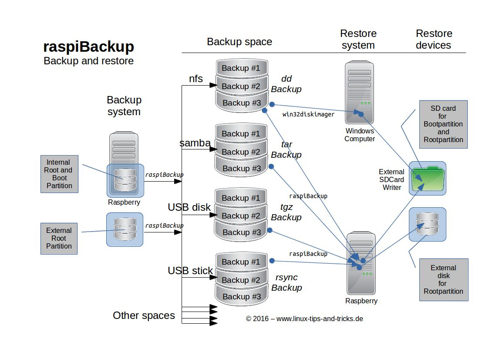

# Function overview

**With *raspiBackup* you can quickly and securely obtain a complete system backup
of your Raspberries and a configurable backup history on a regular basis
and can thus completely restore your Raspberry so that it boots again with an old backup status**.

  - Automatic regular backup of a running Raspberry Pi (it backs itself up)
    See also [Is a backup of a running system reliable? Shouldn't the entire system be stopped before the backup?](faq.md#faq1)

  - Full and incremental backups

      - The backup type `rsync` creates complete and then incremental backups
        using [hardlinks](how-do-hardlinks-work-with-rsync.md).
      - The backup types `dd` and `tar` always create complete backups (also zipped).
        **Note**: With the `dd` backup, you can activate the option that only the space occupied by the partitions
        and not the entire SD card is backed up.

  - Two backup strategies

      - A defined number of backups are kept
      - Backups are kept according to the [grandfather-father-son backup strategy](https://framps.github.io/raspiBackupDoc/smart-recycle.html) (GVS)

  - Two [backup modes](normal-or-partition-backup.md):

      - the **normal backup mode** only backs up the boot and root partition
      - the **partition-oriented mode** backs up any number of partitions on the system device. 

      **Note:** 
      Only partitions on the system device are backed up. Backing up partitions of other devices is not supported. Larger amounts of data can be backed up by raspiBackup using partition-oriented backup if they are stored on other partitions of the system device, such as /dev/sda3 or /dev/mmcblk0p3
 
  - Any number of backups from the past can be stored

    Not only a single backup is created, but also a backup history.
    You can either define a number of backups to be kept,
    or you use the *GFS* principle (in *raspiBackup* called "Intelligent Rotation Strategy"
    see [Grandfather-father-son generation principle](https://framps.github.io/raspiBackupDoc/smart-recycle.html)

  - An intelligent backup strategy is available
    For example, backups of the last 7 days, the last 4 weeks, the last 12 months and
    the last n years can be saved.

  - Simple [installation](installation-in-5-minutes.md) with menu-driven installer (comparable to `raspi-config`)

    The most important options of *raspiBackup* can be configured in German, English, Finnish,
    Chinese and French,
    so that the first [backup in 5 minutes](installation-in-5-minutes.md) can be created.

  - Open source

    *raspiBackup* is available under the GNU license as open source and free of charge.
    However, a [donation](introduction.md#donation) is still welcome 😉

  - All other options, some of which are very powerful, are [documented in detail](invocation-options.md)
    and can be defined in a configuration file.

    The individual backup types are described in detail [here](backup-types.md).
    There is also a [decision tree](backup-types.md#decisiontree),
    to quickly find the right backup type.

  - Any directories and files can be excluded from the backup

  - Different backup types can be mixed per system (e.g. one `rsync` backup per day, one `dd` backup per week)

  - Automatic stopping and starting of active services before and after the backup

  - Backup of any number of Raspberries in a backup directory

  - Messages are supported in German and English, French or Finnish.

  - Notifications

    The backup run messages can be sent from *raspiBackup* by e-mail or *Telegram*,
    *Slack* or *PushOver*. Smilies indicate the success or
    failure of the backup run. Other smilies inform about other important
    events such as the availability of a beta or a new release
    or a reminder to perform a restore test to test the backup integrity.
    
  - Supported email clients: *mailx*/*mail*, *sendEmail*, *ssmtp* and *msmtp*.
    Unsupported e-mail clients can be integrated using an e-mail plug-in.

  - Simple update of *raspiBackup* to the current version

  - Simple distribution of new script versions to a larger number of hosts

  - All boot modes are supported

      1. Boot from a USB device or SSD (USB boot mode): Both partitions
         are located on a USB device. Supported by the newer Raspberries since model 3B
      2. Boot from the SD card: Both partitions are on the SD card
         (every model)
      3. Mixed mode: Boot from the SD card and use the root partition
         from a USB device. This is necessary for older Raspberries that
         do not support USB boot

  - Any backup destinations are possible, e.g.

      - External USB stick
      - External USB disk or SSD
      - *SMB* network drive
      - *NFS* network drive
      - *SSHFS* network drive
      - WebDAV* network drive
      - *FtpFS* network drive
      - Generally any device that can be mounted under Linux

  - An external root file system on a hard disk or USB stick is automatically
    backed up in hybrid boot mode during normal backup mode
    and restored with `tar` or `rsync`.

  - Snapshots

    So-called *raspiBackup* [snapshots](snapshots.md) can be created manually.

    These are named backups that are not deleted automatically.
    They are used, for example, to back up important intermediate steps during system upgrades
    to be able to revert to previous versions at any time in the event of problems. In contrast
    to normal backups a free selectable descriptive text will be be added to the backup directory.
    That way it's possible to identify the purpose of the snapshots.

  - Simple restoration of a backup

    A backup of the `dd` backup type can also be restored from a Windows system.
    *Win32Diskimager* or similar tools can be used.
    `tar` and `rsync` require a Linux system for a restore.
    It is recommended to use a preconfigured SD card with *Raspberry Pi OS*
    and start it on a Raspberry.

  - Adaptation of `/etc/fstab` and `/boot/cmdline.txt` to new UUIDs, PARTUUIDs
    or LABELs so that the system starts again immediately.

  - Active [social media channels](introduction.md#contact_options)

  - Notifications for new releases

    As soon as a beta or a new release is available, *raspiBackup* writes a
    message indicating this. An upgrade is easy to perform. Likewise a
    downgrade back to a previous release.

  - Regression test suite

    The basic functionality of *raspiBackup* (backup and restore) is automatically tested
    for all backup types and modes to ensure that the new *raspiBackup* release
    works as reliably as before.

  - Documentation

    User manual with e.g. FAQs, configuration examples, NFS configuration,
    list of error messages and how to eliminate the error messages
    and much more is documented

  - Helper and sample scripts

    Various [helper and example scripts](useful-helper-scripts.md) are available.

    They can extend the functionality of *raspiBackup* and can either be used unchanged
    or adapted to your own requirements.

    For example, how *pishrink* can be used to make a `dd` backup even smaller
    or how a clone can be created in parallel in order to have an up-to-date boot medium
    that can be used at any time.

    An example script helps to perform further actions before and after the backup,
    such as mounting and unmounting the backup space.

    And much, much more.

  - Extension points

    For developers, *raspiBackup* offers various [extension points](hooks-for-own-scripts.md),
    to perform pre- and post-processing during backup as well as during restore
    by your own code.
    For example there exists an extension which stops docker containers before the backup
    and starts them at the end again.

  - Backup of *NVMe* storage

    Supported for Raspberry 5 and Compute Model 4 (CM4)

  - Supported operating systems

      - RaspbianOS / Raspberry Pi OS
      - Ubuntu

  - Simple system migration to other storage media

    Each backup can be restored to an SD card, USB disk, SSD or NVMe SSD.
    And that easy the system has been moved to another device.

  - Support for *Volumio*

  - Support for *gpt* partitions

[.status]: translated
[.source]: https://www.linux-tips-and-tricks.de/de/funktionsuebersicht
[.source]: https://www.linux-tips-and-tricks.de/de/raspibackup
[.source]: https://www.linux-tips-and-tricks.de/en/features
[.source]: https://www.linux-tips-and-tricks.de/en/backup

