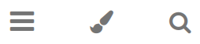

# Usage tips 

At the top of the pages there are two groups of icons for operating
the documentation:



  - Show/hide a table of contents
  - Selection of a theme
  - Search function


  - Language selection (German/English)
  - Print
  - *GitHub* page of the documentation project
  - Suggest changes to the current page in *GitHub

<br>

Type `?` to display a small keyboard navigation aid.

<br>

``` admonish info title="Note"
To reduce the translation effort given the amount of documentation pages all German pages were
translated with [DeepL](https://www.deepl.com) into English.
Thank you very much to DeepL who offers to use the translator for free.
```

[.status]: translated
