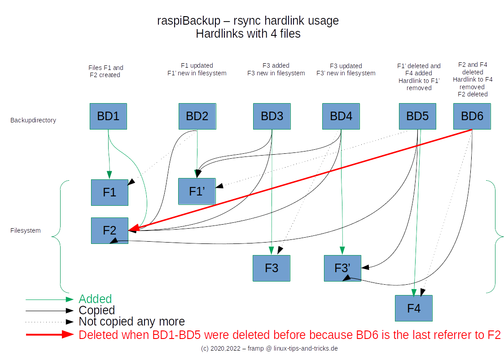

# How do hardlinks work together with rsync

People often ask how the `rsync` backup works and how hardlinks are used for this purpose.
are used for this purpose. The following article describes when *files* are created and deleted in the
created and deleted in the file system and when *hardlinks* are created and
removed.

Hardlinks are a file system capability supported by the Linux file systems
*ext3* and *ext4* are supported. They are pointers that connect a file name with its
content on the file system. This means that hardlinks can be used to access files with
files with different names from different positions in the file tree.
can be referenced. The Linux command `ln` can be used for this purpose, for example.

During an initial `rsync` backup, all **files** are copied and saved in the
backup directory. For the second and each subsequent backup, only the files
only the files that are new or have changed are copied again and deleted files are deleted.
deleted files are deleted.

As a result, all rsync backups except the first one are usually
relatively fast, as long as the amount of data changed is kept within limits.

For all **files** that **have not changed**, **hard links** to the files are created in the
backup directory **hard links** to the files that were backed up in **previous** backups
backups.

If files are deleted, the hard link to the previously backed up file,
that exists in the previous backup is no longer created in the new backup
and therefore the file in the new backup is removed.

This means that you always have full access to a backup status and unchanged files are not
files are not repeatedly backed up and take up disk space. This
saves backup time and space.

A file is only deleted when it no longer has any hard links to it.
This means that as long as there is still at least one backup that refers to the file
file via hard link, the file is not deleted and is available for a restore.
available for a restore.

The following image shows graphically when hardlinks and files are created or deleted.
There is also a corresponding [Youtube video](https://www.youtube.com/watch?v=pIhSca_q2lo), including a demo on the system.

The following graphic shows when F2 in BD6 is deleted in the file system.
However, this is only true if all backups containing
F2 were deleted - i.e. BD1 - BD5.

Many file managers show the disk space used without taking into account
the space saved by hard links and are therefore much too high.
This is especially true for Windows file managers.

The *raspiBackup* [FAQ17](faq.md#faq17) describes how to determine the disk space actually used when using hard links.
disk space when using hardlinks can be determined.

## Weblinks

- du counting harldinks towards filesize](https://stackoverflow.com/questions/19951883/du-counting-hardlinks-towards-filesize) - An article that explains
  why the du command must be executed over multiple directories,
  to see the savings from hardlinks

[.status]: translated
[.source]: https://www.linux-tips-and-tricks.de/de/raspibackupcategoried/571-wie-funktioniert-der-rsync-backup-typ-mit-hardlinks
[.source]: https://www.linux-tips-and-tricks.de/en/raspibackupcategorye/572-how-do-hardlinks-work-with-rsync

