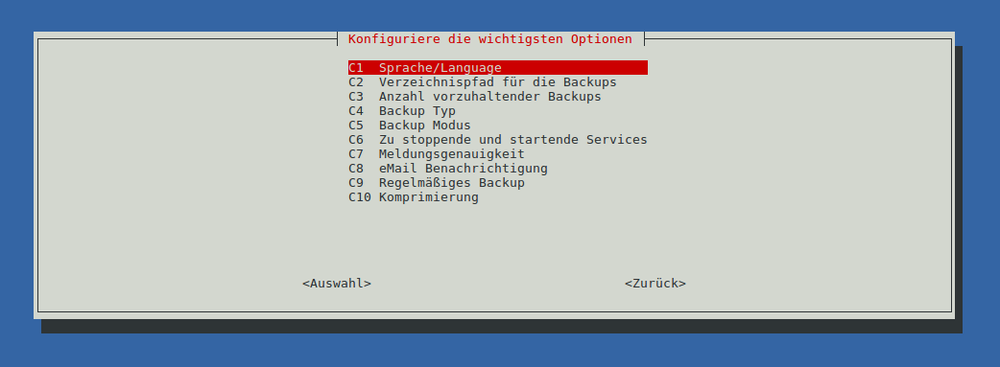

# Quick start - installation in 5 minutes

The documentation of *raspiBackup* has become very extensive due to the wealth of
has become very extensive.

To make it easier to get started, this page therefore briefly explains
how *raspiBackup* can be installed and configured in just a few minutes
and then backups of the Raspberry can be created.

The chapter [Configuration-examples](configuration-examples.md) contains some inspirations for using *raspiBackup*
are listed. These can be used to familiarize yourself with the parameters and thus help with the later
configuration during the installation.

Restoring a backup is described in detail [on a separate page](restore-intro.md).
The primary platforms (Linux, Mac or Windows) of the users are also described there.

**Note:** From *raspiBackup* user [Franjo_G](https://forum-raspberrypi.de/user/57610-franjo-g/) there is another
[Instructions for installing, configuring and using raspiBackup](https://forum-raspberrypi.de/article/7-raspibackup-installation-grundeinstellungen-erstes-backup-und-restore/).in the German Raspberry forum.


## With installer or without?

There are different ways to start *raspiBackup*.

Even an ["adhoc"-use](using-raspibackup-without-installation.md) of *raspiBackup* without any installation is possible.

However, the standard installation with the installer is described here.

**Note**: If you want to read the source code of *raspiBackup* and/or the installer
*raspiBackupInstallUI* before installation, you can do this via the following links:

  - [Download *raspiBackup*](https://github.com/framps/raspiBackup/blob/master/raspiBackup.sh)
  - [Download raspiBackupInstallUI](https://github.com/framps/raspiBackup/blob/master/installation/raspiBackupInstallUI.sh)


## The *raspiBackup* installer

*raspiBackup* has a menu-driven UI installer or configurator,
`raspiBackupInstallUI`, with which it can be easily installed and
and configure the basic features.

There are also update functions for the installer itself and for *raspiBackup*.

Installation is carried out via menus and selection lists. The
menu languages available are German, English, Finnish, Chinese and French.

In the [*raspiBackup* presentation video on Youtube](https://youtu.be/PuK_FNK674s)
a demo of the installation is shown.


<a name="backup-directory"></a>
## Preparation: The backup destination/backup directory

In the standard configuration, *raspiBackup* assumes that there is a
mountpoint `/backup` under which the backup directory is mounted.

This mountpoint should be created before the installation and then
the external backup directory/device (USB disk, USB stick, NFS drive, ...)
should be mounted there.

In the following example, an external USB disk or USB stick is mounted:

```
sudo mkdir -p /backup
sudo mount /dev/sda1 /backup
```

Depending on the desired backup type, *raspiBackup* requires a certain file system for this partition.
This is explained in chapter "[Which file system can be used on the backup partition?](which-filesystem-can-be-used-on-the-backup-partition.md)".
Please note: [Why is it better not to use dd as the backup type](why-shouldn-t-you-use-dd-as-backup-type.md).

**Before** the first backup, it is advisable to check/ensure that the
correct backup destination or the correct backup partition is used.

The following commands are helpful here:

```
sudo blkid -o list
mount | grep backup
```


## Download and install the installer

To download, install and start the *raspiBackup* installer please
in the command line on the Raspberry:

```
pushd /tmp
curl -o install -L https://raspibackup.linux-tips-and-tricks.de/install
sudo bash ./install
popd
```

**Note**: A manual installation without `sudo` usage is documented in an extra
[manual-installation-and-configuration.md).

Now you can select the installation with standard configuration and
change the essential settings in the configuration menu.



All further settings are made in the configuration file
`/usr/local/etc/raspiBackup.conf` with an editor.

Finally, the weekly backup can be activated with *raspiBackup*.

The installer can be restarted at any time in the command line with
`sudo raspiBackupInstallUI` to change the configuration.
change the configuration.


## Systemd to start the backup automatically at regular intervals

After both backup and restore have been successfully tested and the services to be stopped before the backup
services to be stopped before the backup have been configured, *raspiBackup* can be scheduled via *Systemd timer*
for automatic execution at the desired interval.

The Systemd configuration should always be changed with the installer.

Any manual changes in the *Systemd* configuration file `/etc/systemd/system/raspiBackup.timer`
should be made "carefully". They could easily lead to
that the installer can no longer change the configuration file.

Should there be a problem: The installer always creates a debug log in the file
`/root/raspiBackupInstallUI.log`, which helps in the search for the cause.


## The notification by e-mail

Notifications by e-mail require a correctly configured local MTA
such as *Postfix*, *nullmailer*, *msmtp* or *Exim4*. If *Pushover*, *Slack* or *Telegram*
is used, the configuration file of *raspiBackup* must first be manually
with the required configuration data beforehand.
See chapter [General configuration](general-config-options.md).
A notification test can be carried out with the option `-F`.


## Create a backup ...

Since the backup partition is already mounted under `/backup` [(see above)](#backup-directory),
the backup can be started. Perhaps with detailed messages the first time:


```
sudo raspiBackup -m detailed
```

Depending on the size of the installation, this may of course take a little longer...


## ... and test a restore!

**A restore test should then be carried out** ([Link to the
restore documentation](restore.md)) to verify that a consistent backup is being
backup is created and to familiarize yourself with the restore procedure.

**Because:
A backup is useless if, at the moment you want to restore it,
you realize that it is not usable **.

The entire restore process should be run through from time to time and tested,
whether the backups created are in order and whether a system can be restored to working order.
can be restored. *raspiBackup* reminds you of this at regular intervals,
to perform a restore test. The reminder interval can be configured.
The default value is 6 months.

Testing is also particularly important when a new system with a new operating system is
operating system is backed up again with *raspiBackup*. There are always
changes with new operating system versions that can lead to the restore no longer working.
restore no longer works.


<a name="next-steps"></a>
## Further steps

After the first backup has been successfully created and restored
you should take a quiet hour to find out about all the other options of
*raspiBackup* and use them as required.

In any case, it makes sense to read through the [FAQs](faq.md).

Each option can be defined in the configuration file `/usr/local/etc/raspiBackup.conf`,
so that no further options need to be specified when calling.

Details can be found in the chapter [Call and options - Backup - Options](backup-options.md)
and for the options that can **only** be set via the configuration file
in the chapter [Call and options - Backup - Configuration](backup-config-options.md).

Also useful: [raspiBackupDialog - a convenient helper script for raspiBackup](raspibackupdialog-a-convenient-helper-script-for-raspibackup.md),
which simplifies the use and calling of *raspiBackup*.

## Uninstallation

If it turns out that *raspiBackup* does not meet the requirements,
[uninstallation](installer.md#uninstallation) is available via *raspiBackup* Installer.
However, it is advisable to first check via one of the [contact channels](https://framps.github.io/raspiBackupDoc/#contact-options)
whether the missing functionality is indeed not available in raspiBackup.

[.status]: translated
[.source]: https://linux-tips-and-tricks.de/de/installation


