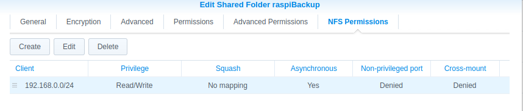
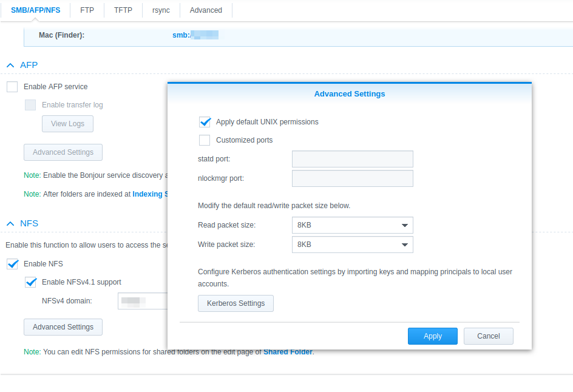

# NFS as backup target 

NFS is a widely used file system under Linux to access files remotely and is perfect for storing backups. Unfortunately, there are different nfs versions and different implementations - depending on the nfs server used. In particular, the nfs servers behave differently with regard to ACLs.

ACLs are not normally used on Raspberries and therefore do not need to be copied to the backup. However, if ACLs are used, it becomes complicated to get them into the backup via nfs. The backup type tar supports ACLs. ACLs are also backed up in the EXT3/4 file system.

nfs version 4 does not support ACLs. nfs version 3 usually does. However, Synology does not support ACLs with version 3 either. The option `nfsvers=3` or `nfsvers=4` can be used to define which nfs version should be used for the mount.

It makes a lot of sense to store the backups from [raspiBackup](https://linux-tips-and-tricks.de/de/raspibackup)
to a NAS and to use the NFS protocol for this purpose. The following describes how
to configure this on a Synology. Of course, you can also use any other NAS as long as it supports NFS.
A Raspberry can also be configured and used as an NFS server.

## *raspiBackup* - Using NFS using the example of a Synology

**Important**: The partition on the NAS must be exported with `no_root_squash`,
so that *rsync* can be used. In the UI, no-mapping must then be entered for squash
must be entered.



You must **NOT** activate *NFS4* as shown in the screenshot! It must
*NFS3* must be used. I could not manage it with *NFS4*.



## Configuration of a Synology and the Raspberry to back up a rsync backup via NFS on a Synology

Essentially, the following steps must be carried out:

1) Create a shared NFS folder on the Synology
2) Mount the shared NFS folder on the Raspi in `/etc/fstab`.
3) Install and configure *raspiBackup* via [Installer](installer.md) (do not configure an automatic backup)
4) Test the backup and restore from the command line
5) Set up the regular backup in the crontab via [Installer](installer.md)

It is recommended that you read the [FAQ](faq.md) before starting, where the most important
questions and answers about *raspiBackup*.

### Create a shared NFS folder on the Synology

In DSM, Control Panel -> Shared Folder -> Create, create a shared folder
shared folder e.g. with the name `raspiBackups`. You do not need a recycle bin
not. The NFS permissions must be set as follows (Note:
*raspiBackup* runs as root). Hostname or IP: Hostname or IP of the NFS
client, e.g. 192.168.0.10. Privilege: read/write, squash: no assignment,
Security: sys.

### Entry of the shared NFs folder on the Raspi in the fstab

The following entry in `/etc/fstab` causes the Synology NFS folder to be mounted
under the mountpoint `/backup` under the assumption that 192.168.0.11 is the Synology
is:

```
192.168.0.11:/volume1/raspiBackups /backup nfs rw 0 0
```

**It is strongly recommended to use the mountpoint `/backup` and not e.g.
`/home/pi/backup` or other directories **.


### Manual mount of the shared NFS folder

Now you can check if the backup space on the Synology is shared with
`showmount -e 192.168.0.11`. Then you can use `sudo mount /backup` to manually mount the NFS
folder manually. With the above entry in `/etc/fstab` the
automatically after every reboot, and a manual mount is no longer necessary.
mount is no longer necessary.

### Test the write access

You can now test the write access with `sudo bash -c 'echo "Raspberry was
here" > /backup/killroy.txt'` and `sudo cat /backup/killroy.txt`.
If there are problems, tips from experienced Synology users on Synology
and *raspiBackup*.

### Installation and configuration of *raspiBackup*

Install *raspiBackup* according to [these instructions](installation-in-5-minutes.md).
Specify `rsync` as backup method and `/backup` as backup path.
Do not configure the regular backup yet.

### Test the backup and restore from the command line

### Set up the regular backup in the installer

Call up the installer and configure the regular backup time.

## Note on ACLs

ACLs can actually be backed up with *NFS3*. This works, for example, if you set up a
Raspberry as an NFS server (see [https://linux-tips-and-tricks.de](https://linux-tips-and-tricks.de/de/synology/2-uncategorised/605-wie-kann-man-acls-mit-rsync-auf-nfs-gemounteten-partitionen-sichern)).
However, this does not work with a *Synology* - even if *NFS3* is used.

An inquiry to Synology on 13.5.2022 provided the following answer:

> Unfortunately, I have to inform you that both Linux ACL and setfacl are not supported by DSM.
> I would be pass this on as feedback to our development department as a function request.

## Hints and tips from *raspiBackup* users who use a Synology as backup space

### Note from Udo

Udo has described in the comment what you have to do so that the automount of the
Synology to work when booting the Raspberry.

It has been reported several times that there can be problems with Synologies with
hardlinks used by rsync when NFS4 is used. With

```
192.168.0.42:/backup /backup nfs rw,nfsvers=3 0 0
```

the NFS3 protocol is used so that the backup script runs successfully.
Furthermore, softlinks with SMB are not supported unless at least SMB version 3 is used.

### Note from Markus

My backup runs with *raspiBackup* in the following configuration:

* Raspberry with Raspbian Wheezy
* *raspiBackup*.sh, version 0.5.7.10e
* Synology NAS DS213, with current DSM version

Synology NAS Share: /volume1/backup
Synology NAS Share NFS rules: Hostname or IP: *, Privilege: Read/Write, Squash: No assignment
Synology NAS Share permissions (console): d--------- 5 root root 4096 Dec 15 06:01 backup
Raspberry Pi mountpoint: /media/nas-backup

Raspberry Pi fstab entries for NFS3 and NFS4

```
# Entry for the NAS backup, mount with NFS version 3
192.168.X.XXX:/volume1/backup /media/nas-backup nfs rw,nfsvers=3 0 0
# Entry for the NAS backup, mount with NFS version 4
#192.168.X.XXX:/volume1/backup /media/nas-backup nfs4 rw 0 0
```

Extract from `raspiBackup.conf` stored under `/usr/local/etc/`

```
cat /usr/local/etc/raspiBackup.conf
# path to store the backupfile
DEFAULT_BACKUPPATH="/media/nas-backup"
# how many backups to keep
DEFAULT_KEEPBACKUPS=4
# type of backup: dd, tar, xbmc or rsync
DEFAULT_BACKUPTYPE="rsync"
```

### Notes from Alfred

Alfred got the following error message from rsync

```
rsync: chown "/mnt/nas/arami nta/araminta-rs ync-backup-2016 1029-190948/mmc blk0p1/overlays /.w1-gpio-overl ay.dtb.ansSC4" failed: Operation not permitted (1)"
```

Then he used the rsync command he found in the *raspiBackup*.log, the
*raspiBackup* to create the backup in order to reproduce the problem and
and to debug specifically without *raspiBackup*. Since he uses the -P mode
mode, he had to execute the following commands first:

```
sudo mkdir /tmp/mmcblk0p1
sudo mount /dev/mmcblk0p1 /tmp/mmcblk0p1
```

He then accidentally made a mistake that led to the solution: This is the rsync
command he executed:

```
rsync --exclude="/mnt/nas" --exclude=/proc/* --exclude=/lost found/* --exclude=/sys/* --exclude=/dev/* --exclude=/boot/* --exclude=/tmp/* --exclude=/run/* --exclude=mmcblk0p1/overlays/* --numeric-ids -aHAXx -v /tmp/mmcblk0p1 "/mnt/nas/test.backup"
```

This command worked without an error message. But it was because
forgot to use 'sudo'. When the command was executed again with sudo
the error message appeared again. IMHO this indicates an access problem
on the Synology NAS. After changing the NFS permissions on the NAS from
**'map all users to admin'** to **'no mapping'**, bingo, it worked again with sudo.
it also worked with sudo.

### Note from Chris

A TAR backup was successfully created via NFS 4.1 on a QNAP NAS as follows.

Contents - `/etc/fstab`:

```
<NAS-IP/hostname>:/<share name> /backup nfs4 defaults,_netdev,noatime 0 2
```


QNAP NAS side (share):

```
Access right -> sync = "no wdelay"
Access right -> secure (Yes)
Host: IP from Raspi
Security: sys,
Squash option: read/write
Squash option: "Assign root user only"
Anonymous GID: guest
Anonymous UID: guest
```

[.status]: translated
[.source]: https://linux-tips-and-tricks.de/de/synology
[.source]: https://www.linux-tips-and-tricks.de/en/synology
