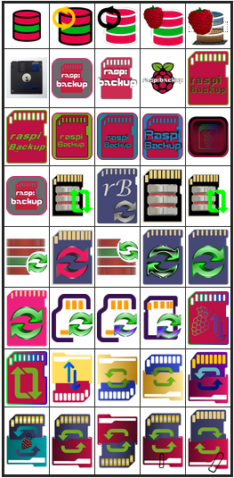

# *raspiBackup* Logo

Friendly [forum members](https://forum-raspberrypi.de/forum/thread/59343-wer-hat-lust-und-zeit-ein-schoeneres-icon-fuer-den-raspibackup-installer-fuer-ub/) from the [German Raspberry Forum](https://forum-raspberrypi.de/forum/) have helped with their knowledge and great effort to create a logo for *raspiBackup*.

It represents the SD card that is being backed up (now it is usually an SSD -
but when *raspiBackup* was created, it was always an SD card). The red folder
at the bottom is the backup folder. And the little paperclip at the bottom right makes sure
that the backups don't fall out of the upside-down backup folder
 and the green arrows indicate the respective backup and restore process.

Here is a selection of beautiful logos that were created during the discussion and brainstorming:

[.status]: translated
[.source]: https://www.linux-tips-and-tricks.de/de/raspibackupcategoried/653-raqspibackup-has-a-new-logo
[.source]: https://www.linux-tips-and-tricks.de/en/raspibackupcategorye/654-raspibackup-has-a-new-logo

