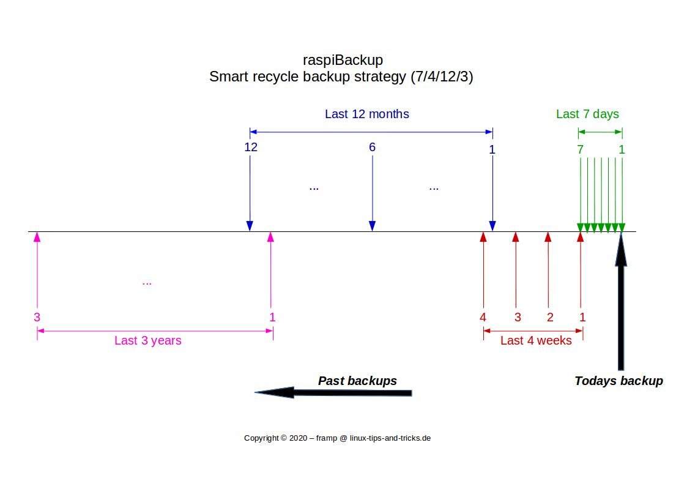

# Intelligent rotation strategy - Smart Recycle

*raspiBackup* can either keep a configurable number of backups or use an intelligent backup rotation strategy.
rotation strategy of the backup. It is also called the ["generation principle in
of data backup"](https://de.wikipedia.org/wiki/Generationenprinzip). The implementation was inspired by Manuel Dewald's
article ["Automating backups on a Raspberry Pi NAS"](https://opensource.com/article/18/8/automate-backups-raspberry-pi).
The following backups are then kept by default,
if daily backups are created:

  1. Backups of the current day and the last 6 days
  2. Backups of the current week and the last 3 weeks
  3. Backups of the current month and the last 11 months
  4. Backups of the current year and the last 2 years

This can be adapted to the respective requirements using the installer.

If weekly backups are created, the daily backups are of course omitted.
The respective retention periods for daily, weekly, monthly and yearly backups can be
annually can be configured with options.

So if you only want to have weekly, monthly and annual backups, this can be configured.
this can be configured. It should be noted that the weekly backup day then
backup day defines the backup day of the month: If, for example, Monday is configured as
weekly backup day, the monthly backup is always on the first Monday of the month and the
Monday of the month and the annual backup on the first Monday of the year.

``` admonish info title="Note"
If several daily backups are possible, the **newest** daily backup is always kept.
backup is always kept. For the weekly, monthly and annual backups
the **oldest** backups are kept.

For example, with two existing daily backups from 10:00 and
13:00, the backup created at 13:00 is selected.

If there are backups on Monday and Friday during the week, the weekly backup
of Monday is selected.

If there is a backup on the 1st, 10th and 20th of a month, the backup from the
1st is selected for the monthly backup.

For daily backups, weekly backups are therefore always from Monday,
monthly backups always from the first of the month and
annual backups always from the 1st of the year.
```

## Graphical representation




## Example - backup directory (daily backup run, default options: 7/4/12/3)

```
    (backup run on 17.11.2019)

    20191117 1. daily backup
    20191116 2. daily backup
    20191115 3. daily backup
    20191114 4. Daily backup
    20191113 5. Daily backup
    20191112 6. Daily backup
    20191111 7. Daily and 1st weekly backup

    20191101 1. monthly backup
    20191104 2. weekly backup
    20191001 2. monthly backup
    20191028 3. weekly backup
    20191021 4. Weekly backup
    20190901 3. monthly backup
    20190801 4. monthly backup
    20190701 5. monthly backup
    20190601 6. Monthly backup
    20190501 7. Monthly backup
    20190401 8. Monthly backup
    20190301 9. monthly backup
    20190201 10.monthly backup

    20190101 11. Monthly backup and 1st annual backup
    20181201 12. Monthly backup
    20180101 2. yearly backup
    20170101 3. annual backup
```

## Options

The intelligent rotation strategy is activated with the `--smartRecycle` option.
The storage quantities can be redefined with the `--smartRecycleOptions` option.
The `--smartRecycleOptions "7 4 12 3"` option is active by default.
With `--smartRecycleOptions "0 4 12 0"`, for example, the last 4
weekly and the last 12 monthly backups are retained.

``` admonish caution title="Important note"
As long as the option `--smarteRecycleDryrun` is not switched off
*raspiBackup* only writes messages about which backups would be deleted and which would be kept.

You can therefore first check whether the result corresponds to what you want.
This prevents existing backups from being deleted unintentionally.

This is particularly important if, after switching to the intelligent rotation strategy
you want to continue using the previous backup directory and not use a new directory.

If you have carefully checked that the intelligent rotation strategy deletes the
deletes the correct backups and removes the desired backups, the
option `--smartRecycleDryrun-` (note the `-` at the end!) in each backup run
the intelligent rotation strategy is applied and
**backups that are no longer required are deleted irrevocably**.

Alternatively, the configuration option

`DEFAULT_SMART_RECYCLE_DRYRUN=0`

produces the same result.
```

On Wikipedia - in the article [Generation principle](https://de.wikipedia.org/wiki/Generationenprinzip) - it is nicely explained
how the rotation principle works.
The diagram in particular is another way of explaining the principle.


[.status]: translated
[.source]: https://www.linux-tips-and-tricks.de/de/rotationsstrategie
[.source]: https://www.linux-tips-and-tricks.de/en/smart-recycle


